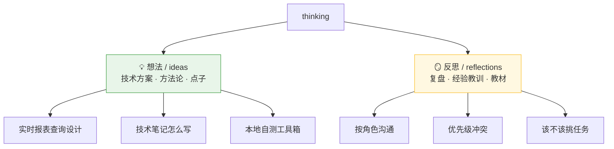
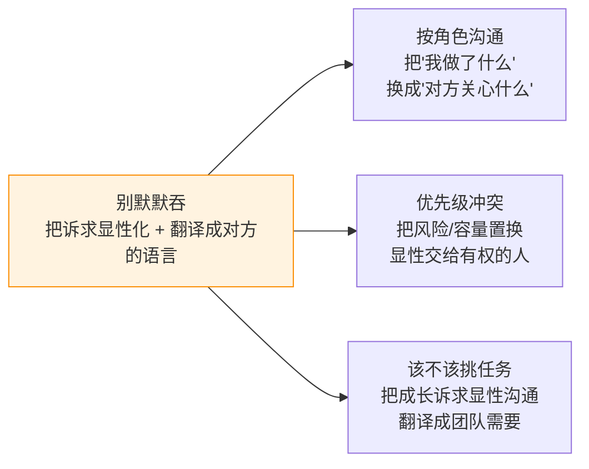

# 目录索引

`thinking` 的内容索引。两类:**想法(ideas)** 和 **反思(reflections)**。
仓库定位见根目录 [`CLAUDE.md`](../CLAUDE.md)。

---

## 💡 想法 / ideas

| 文档 | 一句话 |
|------|--------|
| [实时报表查询设计](想法/实时报表查询设计.md) | 用查实时表替代定时任务跑批;MySQL 从库 vs ClickHouse 选型;实时 + 历史冷热分离 |
| [技术笔记怎么写才能在面试中讲清楚](想法/技术笔记怎么写才能在面试中讲清楚.md) | 三层记录法(事实/故事/原理)+ STAR 升级版,把经验讲成有逻辑的故事 |
| [本地自测工具箱-逼出隐藏bug](想法/本地自测工具箱-逼出隐藏bug.md) | 本地自测四层框架 + 工具清单,重点补"主动制造边界/并发/故障"层 |

## 🪞 反思 / reflections

| 文档 | 一句话 |
|------|--------|
| [职场按角色沟通复盘](反思/职场按角色沟通复盘.md) | 运维要文件、PM 关心进度两个场景:按"对方关心什么"沟通,别以我为中心 |
| [夹在老板与产品之间的优先级冲突](反思/夹在老板与产品之间的优先级冲突.md) | 老板要改 vs 产品排后面:别独自拍板;隐形工作=出力不讨好,容量置换要上台面 |
| [该不该挑任务-成长与被信任的平衡](反思/该不该挑任务-成长与被信任的平衡.md) | 挑/不挑是假二选一:先攒信任再换方向,提升靠"怎么做"而非"做什么" |

---

## 🧵 一条贯穿职场三篇的主线

三篇职场反思其实是**同一个根**:

> **别当那个把冲突/诉求默默吞掉的中间人——把它显性化,并翻译成对方关心的语言。**

- **按角色沟通**:把「我做了什么」换成「对方关心什么」。
- **优先级冲突**:把风险、容量置换显性化,交给有决策权的人拍板,并留痕、让结论回流。
- **该不该挑任务**:把成长诉求显性沟通,翻译成"团队的活有没有人好好干"。
