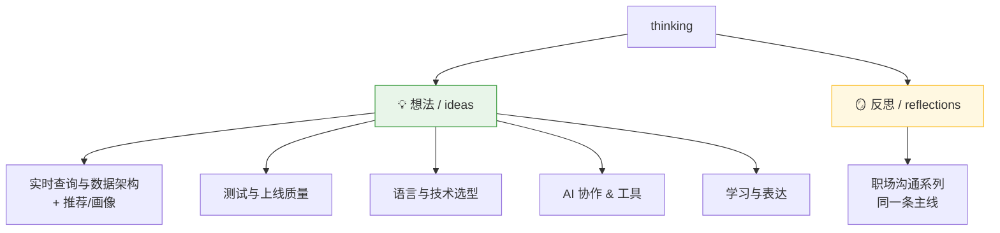
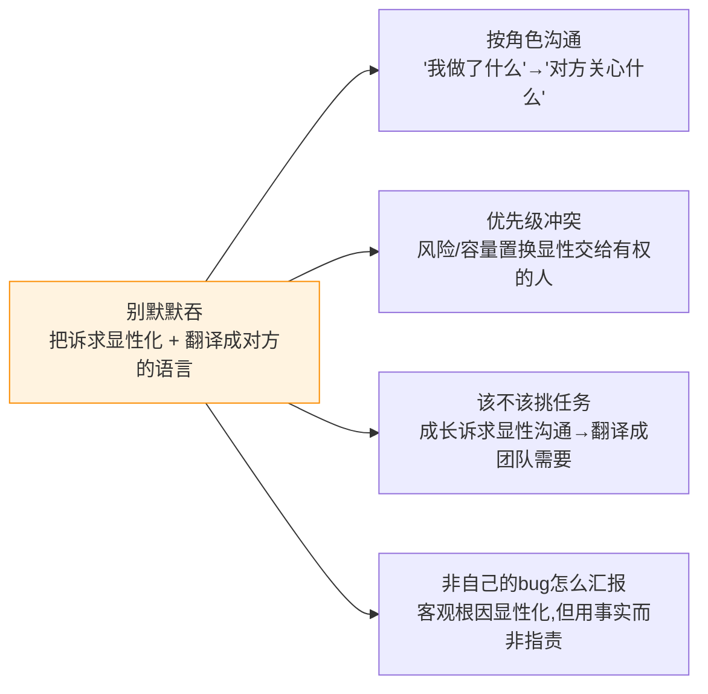

# 目录索引

`thinking` 的内容索引。两类:**想法(ideas)** 和 **反思(reflections)**,各自再按子主题分组。
仓库定位见根目录 [`CLAUDE.md`](../CLAUDE.md)。

> 📅 另有参考文档:[工作日历-大小周与菲律宾节假日2026](工作日历-大小周与菲律宾节假日2026.md)(纯备查,不属想法/反思)。

---

## 💡 想法 / ideas

### 🗄️ 实时查询与数据架构
| 文档 | 一句话 |
|------|--------|
| [实时报表查询设计](想法/实时报表查询设计.md) | 用查实时表替代定时任务跑批;MySQL 从库 vs ClickHouse 选型;实时 + 历史冷热分离 |
| [实时查询架构-CK-MySQL-ES与Flink怎么配合](想法/实时查询架构-CK-MySQL-ES与Flink怎么配合.md) | Flink 是实时计算非查询;CK/MySQL/ES 按查询类型分工;大盘5分钟分桶用 CK 物化视图+State 再聚合 |
| [ClickHouse-MergeTree引擎家族区别](想法/ClickHouse-MergeTree引擎家族区别.md) | 区别全在"merge 时对相同排序键的行怎么处理";查询端要用 FINAL/-Merge 兜口径 |
| [推荐系统与用户画像设计](想法/推荐系统与用户画像设计.md) | 数据底座+One-ID画像分层+推荐召回/排序/重排+反馈闭环;落到 Kafka/Flink/CK/ES/Redis 双链路 |

### 🧪 测试与上线质量
| 文档 | 一句话 |
|------|--------|
| [本地自测工具箱-逼出隐藏bug](想法/本地自测工具箱-逼出隐藏bug.md) | 本地自测四层框架 + 工具清单,重点补"主动制造边界/并发/故障"层 |
| [单功能测试与可mock设计](想法/单功能测试与可mock设计.md) | 大项目不全量启动测单功能:切片+mock+单测运行(治标)、DI+接口+IO推边界(治本) |
| [AI自主摸索后台测试是否可行](想法/AI自主摸索后台测试是否可行.md) | AI 摸得出"机制"摸不出"业务对错"(oracle problem);适合探路/压测/起草用例,不适合当裁判 |
| [大数据场景的降风险与本地模拟测试](想法/大数据场景的降风险与本地模拟测试.md) | 找 DBA 要"数据画像"清单 + 降风险 + 本地造大数据(分布真比量大重要);含"有数据可跑+两边核对" |
| [防止线上出问题-测试环境测不出的怎么防](想法/防止线上出问题-测试环境测不出的怎么防.md) | 测试鸿沟堵不死→纵深防御:同镜像缩差异、影子流量提前撞、灰度+开关控爆炸半径、监控+降级+回滚 |

### 🧭 语言与技术选型
| 文档 | 一句话 |
|------|--------|
| [AI时代选Java还是Go-语言选择](想法/AI时代选Java还是Go-语言选择.md) | AI 拉平"写得出来"却没拉平"判断得对";结构性判断是 AI 盲区;含风险/收益不对等的个人视角 |
| [什么场景用什么语言](想法/什么场景用什么语言.md) | 默认看团队擅长,只有场景"硬约束"才推翻;场景→语言速查;polyglot 有代价、AI 不改变结论 |

### 🤖 AI 协作 & 工具
| 文档 | 一句话 |
|------|--------|
| [Claude-Code实用技巧](想法/Claude-Code实用技巧.md) | 上手即用:上下文管理(/context·/compact·子代理)、四符号(/ @ ! #)、CLAUDE.md、计划模式、cleanupPeriodDays |
| [怎么给AI好上下文](想法/怎么给AI好上下文.md) | 把AI当没记忆的新同事:高价值上下文清单、稳定→CLAUDE.md/任务→简报md用@引用、历史精准投喂、任务简报模板 |

### ✍️ 学习与表达
| 文档 | 一句话 |
|------|--------|
| [技术笔记怎么写才能在面试中讲清楚](想法/技术笔记怎么写才能在面试中讲清楚.md) | 三层记录法(事实/故事/原理)+ STAR 升级版,把经验讲成有逻辑的故事 |

---

## 🪞 反思 / reflections

### 职场沟通系列
| 文档 | 一句话 |
|------|--------|
| [职场按角色沟通复盘](反思/职场按角色沟通复盘.md) | 运维要文件、PM 关心进度两个场景:按"对方关心什么"沟通,别以我为中心 |
| [夹在老板与产品之间的优先级冲突](反思/夹在老板与产品之间的优先级冲突.md) | 老板要改 vs 产品排后面:别独自拍板;隐形工作=出力不讨好,容量置换要上台面 |
| [该不该挑任务-成长与被信任的平衡](反思/该不该挑任务-成长与被信任的平衡.md) | 挑/不挑是假二选一:先攒信任再换方向,提升靠"怎么做"而非"做什么" |
| [出了问题但不是自己的bug-如何汇报](反思/出了问题但不是自己的bug-如何汇报.md) | 让事实替你撇清、分寸替你保人;对事不对人、私下先同步、也认领自己这边的改进 |

---

## 🧵 一条贯穿职场反思的主线

四篇职场反思其实是**同一个根**:

> **别当那个把冲突/诉求默默吞掉的中间人 —— 把它显性化,并翻译成对方关心的语言。**

