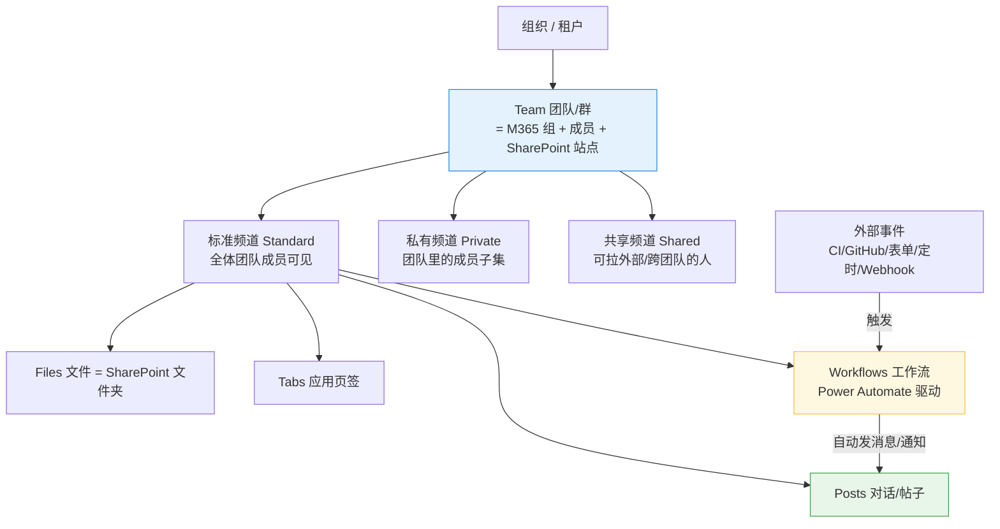

# Teams 使用备查:群 / 频道 / 工作流 + 通知配置

> 一份 **Microsoft Teams 使用参考**(不属"想法/反思",纯备查)。
> 两部分:① Team / Channel / Workflows 的层级关系;② 让通知"像 Telegram 一样即时"的配置。
> 操作环境按 **Windows**。

---

## 一、层级关系:Team → Channel → 内容/工作流

| 层级 | 是什么 | 关系 |
|------|--------|------|
| **Team(群)** | 一群人 + 资源的顶层容器(背后是 M365 组 + SharePoint) | 1 个 Team **包含多个** Channel |
| **Channel(频道)** | 按主题/项目划分的子空间 | 属于某 Team;含 **Posts/Files/Tabs** |
| **频道内容** | Posts(聊天)、Files(SharePoint)、Tabs(挂应用)、**Workflows** | 都挂在频道下 |
| **Workflows(工作流)** | Power Automate 自动化:外部事件→自动发消息/通知,或频道事件→触发动作 | **挂在频道/聊天上**,是"自动化层" |

### 频道三种类型(决定谁能看)
- **标准 Standard**:全体团队成员可见。
- **私有 Private**:团队里的成员子集,独立名单。
- **共享 Shared**:可纳入外部/跨团队的人。

### Workflows 扮演什么
- Teams 里的**自动化层**(Power Automate,取代旧的 Incoming Webhook/连接器)。
- 典型:**外部系统 → 频道**(CI 失败、GitHub PR、表单提交、定时提醒自动播报);或 **频道事件 → 触发动作**。
- 挂载点是**频道/聊天** —— 工作流"住在" channel 里,给它加自动消息能力。

> 一句话:**Team 是"群",Channel 是群里按主题分的"房间",Workflows 是给房间装的"自动化机器人"。** 层级:Team ⊃ Channel ⊃ (Posts/Files/Tabs/Workflows)。

---

## 二、让通知"像 Telegram 一样即时"

Teams 默认三个"坑":①频道消息默认不弹、②手机端在你电脑活跃时不推、③安卓省电延迟到达。把这三个关掉就接近 Telegram 了。

### 桌面端(新版 Teams,Windows)
- **通知和活动(Notifications and activity)**:通知样式选 **"Windows"**;设 **横幅 + 动态**,**开声音**;聊天/@提及/回复都设弹横幅。
- **频道消息(最易漏)**:进在意的频道 → `…` → **频道通知 → 全部活动(All activity)**。
- 别让系统压掉:Teams 状态别设 **请勿打扰**;**Windows 设置 → 系统 → 通知** 确认 Teams 开启,关 **专注助手 / 勿扰**。

### 手机端(即时送达的关键)
- Teams App → **设置 → 通知** → "**当我在桌面端活跃时**"改成**仍然发送(始终)**。
- **关掉 Teams 的省电限制(尤其安卓)**:系统 → 应用 → Teams → 电池 → 不受限制 —— 这是安卓推送延迟的头号原因。
- iOS:允许通知、横幅、声音、锁屏。

### 五个最关键开关
1. 频道通知设 **全部活动**(桌面)
2. 通知样式用 **Windows**
3. 关 **勿扰 / 专注助手**
4. 手机端 **"桌面活跃时仍推送"**
5. 关 **安卓省电优化**

> 提醒:Teams 故意在桌面活跃时压手机推、频道默认安静,所以**默认不像 Telegram**,得手动调;调完也未必 100% 一致,但上面五项是"即时+可靠"的关键。
