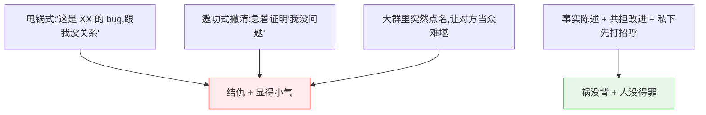
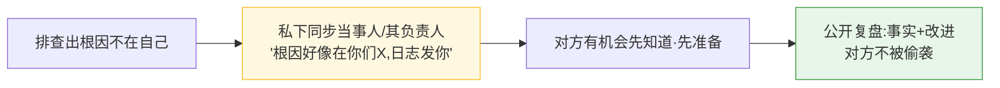

# 出了问题,但根因不在自己:怎么汇报才不得罪人

> 场景:出了一次故障,排查到最后发现**并不是自己的 bug 导致的**。
> 该怎么汇报,既能说清楚、又不得罪当事人?
>
> 核心结论:这里有**两个目标要同时拿下** ——
> ① 让事实说清楚(不背不属于自己的锅);② 别得罪人(关系与后续协作)。
> 解法是同一个:**让事实替你说话,你就不必开口指责。**
> **事实护你不背锅,分寸护你不树敌。**

---

## 一、为什么"撇清"和"不得罪"能同时做到

看似两难,其实同源:**对事不对人 + 用事实说话。**

当你把客观的时间线、日志、根因摆出来,**事实自然会洗清你,你根本不需要说"看,不是我的错"。**
一旦你开口去"指认是谁",就从「报告事实」掉进「追责」——那才是得罪人的真正动作。

> 呼应另几篇职场反思:这仍是那条主线 ——
> 别默默吞下不属于你的锅(把事实显性化),但也别用指责的方式去显性化。

---

## 二、三个最容易踩的坑



- **甩锅式**:直接说"是谁谁的问题"——结仇,且显得你只关心摘干净自己。
- **邀功式撇清**:急吼吼自证清白——显得防御、小气,反而像心虚。
- **公开点名**:在大群里 surprise 当事人,让他当众难堪——结下最深的梁子。

---

## 三、四条原则

1. **对事不对人**:讲"订单服务在空库存时返回了 null",不讲"XX 写的代码有问题"。
   把主语从**人**换成**系统 / 模块**。
2. **事实说话,中性陈述**:时间线 + 日志 + 根因,不加形容词、不带情绪。
   证据越硬,你越不用辩解。
3. **先解决后定责(blameless)**:复盘先讲影响、处理、恢复、怎么防下次;
   根因只作客观陈述,不是审判谁。
4. **给台阶 / 留面子**:用"我们一起定位到根因在 X 模块"的**共同体语气**,
   别用"抓现行"的语气。

---

## 四、顺序很关键:私下先同步,公开再复盘

**别在大群里 surprise 当事人。**



先私下给对方打个招呼,让他**有机会先知道、先准备**,公开复盘时就不会觉得被偷袭。
**这一步能化解大半的"得罪"。**

---

## 五、一个同时"撇清又不甩锅"的关键动作:也认领自己这边的改进

哪怕根因不在你,也讲一句:
**"我们这边也会加一道防御 + 告警,下次能更早拦住。"**

这一下做了两件事:
1. 证明你不是在甩锅,而是在解决问题;
2. 真的让系统更稳(很多故障是"上游出错 + 下游没防御"共同造成的)。

> **愿意一起分担改进,是"不得罪人"最有效的姿势。**

---

## 六、汇报 / 复盘结构模板

```
【影响】何时、什么坏了、影响范围、持续多久
【时间线】几点几分发生→几点发现→几点恢复(纯事实)
【根因】X 模块在 Y 条件下返回/产生了非预期的 Z(客观陈述,不点名批判)
【处理与恢复】当时怎么止血、怎么恢复的
【改进】
  - 上游:根因侧的修复(由对应负责人认领)
  - 我方:增加防御 / 校验 / 告警 / 契约测试(主动认领)
  - 系统:怎么更早发现(监控、告警阈值)
```

---

## 七、话术对比

| | |
|---|---|
| ❌ 甩锅 | "这次故障是 XX 那边的 bug 导致的,跟我没关系。" |
| ✅ 得体 | "复盘一下:订单服务在空库存时返回了 null,我们的接口没防御直接 NPE。根因在上游返回值,已和订单同学同步、他们在修;我们这边也补一道防御 + 告警。" |

得体版:根因说清了(你洗清了)+ 没点名指责 + 带了自己的改进 + 提了已私下同步
—— **滴水不漏,又没树敌。**

---

## 八、一句话总结

> **让事实替你撇清,让分寸替你保人。**
> 你要做的不是"证明不是我",而是"把客观根因和改进讲清楚";
> 锅自然不在你头上,而当事人也欠你一个台阶。
