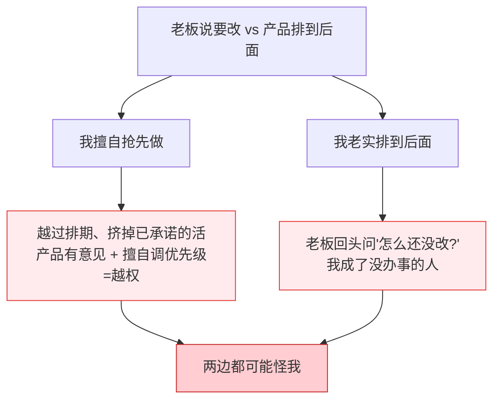
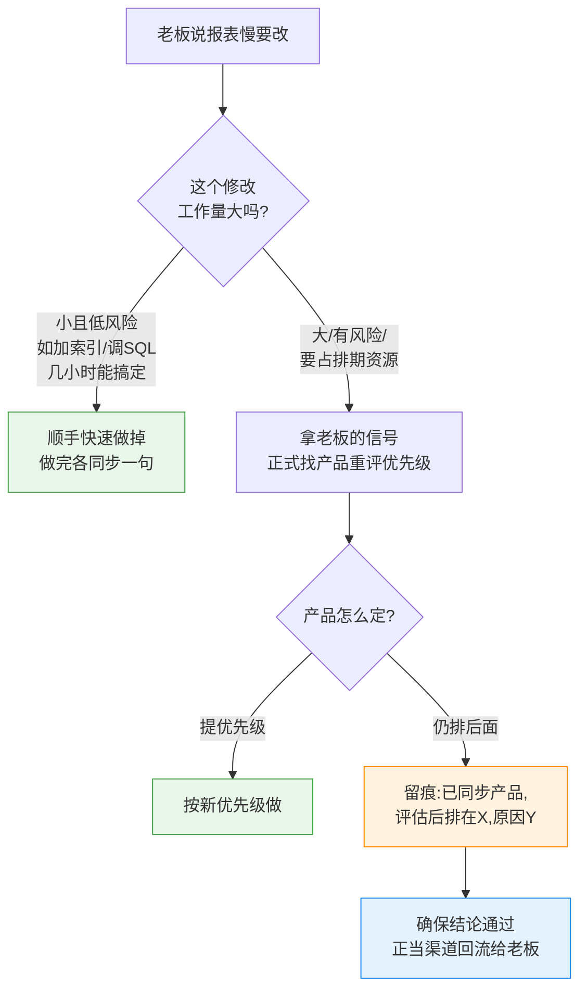
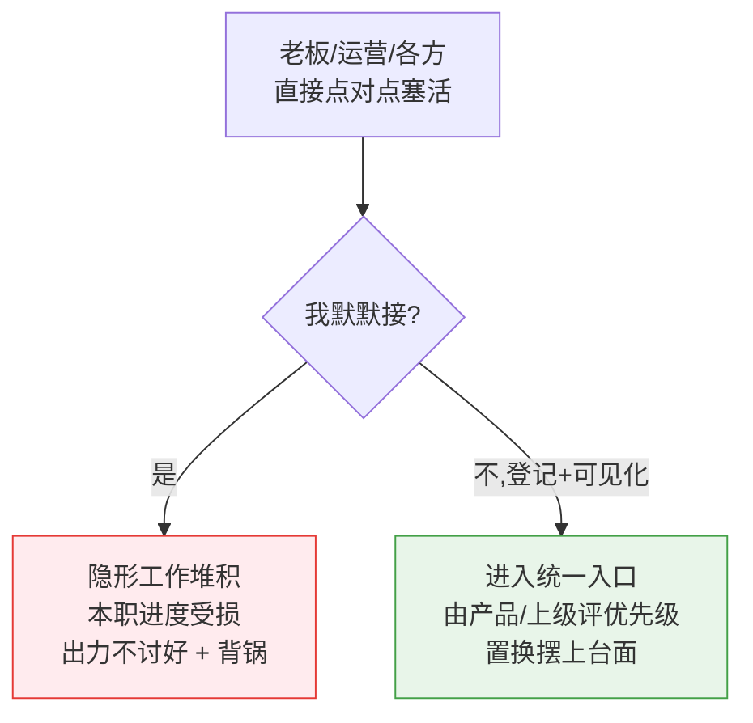

# 职场反思:夹在「老板」与「产品」之间的优先级冲突

> 真实场景:老板过来说某报表查询慢、需要改;我同步给产品后,被排期到后面。
> 我到底该**优先做**还是**排到后面**?又**不能越级汇报**,该怎么办?
>
> 核心结论:**这不是"做不做"的二选一,而是"别自己一个人扛这个决定"。**
> 优先级不该由我拍板,而该由有决策权的人拍板;我的职责是把信息给齐、留痕、让结论回流。

---

## 一、为什么左右都可能背锅

这本质和「按角色沟通」那篇是**同一个坑**:我又被夹在中间,想独自决定、独自承担。

- 老板的话 = **优先级信号**(非正式,但来自高层)。
- 产品的排期 = **正式流程**(谁先谁后由产品定)。
- 两者打架,而我想自己选一个——结果无论选哪个都可能背锅:

**根因**:我把"优先级决策"揽到了自己身上,又默默把冲突吞掉。
正确姿势是——**优先级归产品/有决策权的人,我负责把信息给齐并留痕。**

---

## 二、正确处理流程

### 1. 先判断成本——能顺手解决就别走流程
如果只是加个索引、调个 SQL,几小时能搞定且低风险,**直接做掉**,做完跟产品、老板各同步一句。
当"走流程的成本"高于"修复成本",快速解决就是最优解,还顺带满足了老板。

### 2. 大改:把老板的话当"优先级信号"正式带回产品
> 「老板提到这个报表慢、希望改,现在排在 X 之后,要不要重新评估一下优先级?」

**这不是越级,是给产品决策所需的信息。** 优先级是产品的职责,让他来定。

### 3. 无论结果如何,都要留痕
产品仍排后面,就记下来:**"已同步产品,评估后排在 X,原因是 Y。"**
这样老板问起时有据可依,而且这个决定是产品做的,不是我。

### 4. 确保结论"回流"到老板(对应"老板不知道"这个隐患)
不能越级直接找老板汇报,但可以让信息通过**正当渠道**回去:
- 让产品/PM 去同步;或
- **找自己的直属上级**说一句"老板提了这个,产品排后面了,要不要知会一下"。

> 找直属领导请示 ≠ 越级。越级是绕过该走的人;向上请示是用对链路。

---

## 三、关于「不能越级」的边界

| 做法 | 算不算越级 | 说明 |
|------|-----------|------|
| 把老板的需求同步给产品,请其重评优先级 | ❌ 不算 | 正常的横向协作,给决策者信息 |
| 找自己的直属上级请示该怎么处理 | ❌ 不算 | 用对汇报链路 |
| 绕过产品/直属领导,直接找老板拍板 | ✅ 算越级 | 跳过了该决策的人 |
| 自己擅自调整优先级、抢先做大改 | ⚠️ 越权 | 优先级不归我定 |

---

## 四、为什么"默默做"风险最大:隐形工作与容量置换

后来还冒出两个顾虑,正好戳破了"自己悄悄做掉"这个选项的真面目:

> - 「做了可能影响我其他工作进度,**反而出力不讨好**。」
> - 「**运营的 bug 也直接给我让我改了**。」

**根源:隐形工作。** 当我悄悄接活,我拿到的是——
100% 的成本(挤占自己时间)+ 0% 的功劳(没人知道我做了)+ 还要为被挤掉的本职工作"进度慢"背锅。
这就是"出力不讨好"的来源:**隐形工作既不被记功,又拖垮本职 KPI。**

解药不是"那我不帮了",而是 **工作可见化 + 把"容量置换"摆上台面**:

> 产能是固定的。**接了 A,B 就得往后。** 这个置换不该我一个人默默吞,而要摆给产品/上级:
> 「我可以做这个报表优化,但手上的 X 就要顺延,你看怎么排?」

效果:付出被看见(不再出力不讨好)→ 进度延后是"被插队"所致(不再背锅)→ 谁插队、谁让步由有权的人定。

## 五、临时插队需求(如运营直接塞 bug)怎么接

运营直接把 bug 点对点塞给我改,是**同一个病**:临时需求绕过流程、直接塞人。

- **小的、一次性 bug**:可以顺手修,但**也要登记一句**(进群同步 / 记到看板),别让它彻底隐形。
- **若运营经常直接塞**:和直属上级/产品**约定一个入口规则**——
  运营的 bug 走统一入口、由产品评优先级,而不是私下点对点塞给我。
  否则我就成了所有人的"隐形外包",本职排期还受损。(这个约定也通过直属上级去推,不越级。)

> 原则:**产能有限,凡是插进来的活都要"可见 + 有人拍板置换"。**

## 六、一句话总结

> **我要做的不是"替所有人做决定",而是"让该决定的人拿着完整信息去决定,并让所有人都知道这个决定"。**
> 只要别当那个把冲突和插队默默吞掉的中间人——付出被看见,责任有人担,就不会出力不讨好、也不会背锅。
