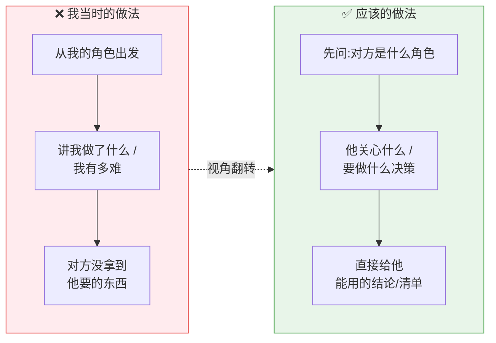
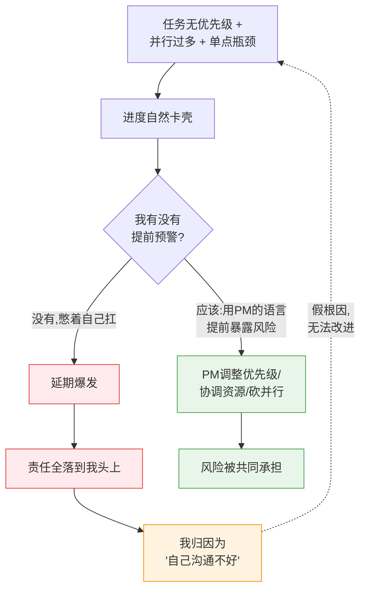
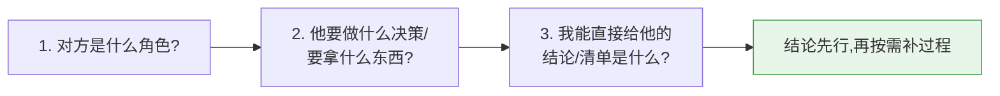

# 职场沟通复盘:按「角色关心什么」去沟通

> 一次真实的复盘教材。核心教训一句话:
> **对方要的是「他关心的东西」,不是「我做了什么」。**
> 沟通的起点永远是对方的角色和诉求,不是我的视角和付出。

---

## 一、事件经过

### 场景 A:运维组长要文件

运维组长来要文件。我却站在**开发的视角**,讲了一堆「我开发都做了什么、
实现了哪些功能、遇到过什么问题」。

但这些他**根本不关心**。他只想要两样东西:

1. 要**配置那些文件**(具体是哪几个、放哪)。
2. 需要给他**什么资源**(部署/运行环境需要什么)。

结果:我说了很多,却没正面给到他要的清单,沟通效率很低。

### 场景 B:项目管理(PM)只关心进度

PM 关心的是:**进度到哪了、还要多久。**

而我实际发现的问题是:

- 任务**没有优先级、没有侧重点**;
- **并行任务太多**,到处卡壳;
- 某个**关键节点卡在某个人身上**(单点瓶颈)。

但这些结构性问题我没有用 PM 听得懂的方式讲出来。最后:
**所有延期都怪到我头上,我也只能反过来说「自己沟通不好」。**

---

## 二、问题分析:到底错在哪

### 错误的共性 ——「以我为中心」输出

两个场景错的是同一件事:**我输出的是「我的视角」,不是「对方的诉求」。**

### 场景 A 的具体偏差

- 运维要的是**可执行的交付物**(文件清单 + 资源需求),
  我给的是**过程叙事**(开发历程)。
- 错位:**他要「结果/输入」,我给「过程」。**

### 场景 B 的具体偏差 —— 这才是更深的坑

「自己沟通不好」其实是个**假根因**,容易让人停在自责,无法改进。
真正的链条是:

**真根因**:发现了结构性风险(无优先级、并行过载、单点瓶颈),
却没有**用 PM 关心的语言**(进度风险、关键路径、谁挡住了谁)**及时、显式地暴露出来**,
而是自己默默扛,扛不住了才爆发,于是责任全归我。

「沟通不好」是表象;**「没有把风险翻译成对方的语言并前置暴露」才是本质。**

---

## 三、方法沉淀:按角色沟通的「关心矩阵」

每个角色都有自己的「关心点」和「禁忌」。沟通前先对号入座:

| 角色 | 他真正关心 | 我该先给 | 禁忌(别做) |
|------|-----------|----------|-------------|
| **运维** | 部署/运行要什么、出问题怎么办 | 配置文件清单、资源需求、依赖、回滚方式 | 讲开发实现细节、讲我多辛苦 |
| **项目管理(PM)** | 进度、还要多久、风险、谁卡谁 | 当前进度、ETA、阻塞点、关键路径、需要的决策 | 报喜不报忧、憋着不预警、只给技术细节 |
| **开发同事** | 接口/契约、依赖、改动影响 | 接口定义、依赖关系、影响范围 | 含糊的口头约定、不同步变更 |
| **测试** | 改了什么、怎么验、边界 | 变更点、验证方式、影响范围、数据 | 只说"我改好了"不说改了哪 |
| **产品** | 能不能做、做多久、对用户的影响 | 可行性、成本、取舍方案 | 一堆技术名词、直接说"做不了" |
| **上级/领导** | 结论、风险、要不要他拍板 | 结论先行、风险点、需要的支持 | 大段过程铺垫、把问题甩过去不带方案 |

### 通用沟通禁忌(踩过的)

1. **以我为中心**:讲「我做了什么/我多难」,而不是对方要什么。
2. **报喜不报忧**:风险憋着不说,等爆发才暴露 —— 责任必然全归自己。
3. **过程先行**:先铺垫一堆背景,迟迟不给结论。
4. **把假根因当结论**:用「我沟通不好」自责收尾,放弃了真正的改进。
5. **被动等问、不主动暴露**:尤其是风险和阻塞,要主动前置。

---

## 四、改进行动(下次怎么做)

### 通用动作:沟通前先做「三问」

### 针对场景 A(运维):

- 上来直接给清单:**「需要配置 X / Y / Z 文件,分别放在……;需要的资源是……」**
- 开发过程不主动展开,他问到再说。

### 针对场景 B(PM):把结构问题翻译成进度语言

不要说"我沟通不好",而要**前置、显式、带方案**地暴露:

> 「当前有 N 个任务并行,其中关键路径卡在【某模块/某人】上;
> 建议按优先级砍掉/后置【低优先级任务】,集中资源先打通关键节点;
> 否则预计延期 X 天。需要你协调【资源/决策】。」

这样:
- 把**单点瓶颈、并行过载**变成 PM 能行动的**进度风险 + 决策请求**;
- 风险**前置共担**,而不是事后独自背锅;
- 提供**方案选项**,而不是只抛问题。

### 给自己的长期提醒

- **自责 ≠ 改进**。下次想说"我沟通不好"时,逼自己再追一层:
  到底是哪个环节、面对哪个角色、漏了什么信息?写下来才算复盘。
- **风险要主动喊**,喊早了顶多是虚惊,喊晚了一定是背锅。
- 定期回看这份教材,沟通前过一遍「关心矩阵」。

---

## 五、一句话总结

> **沟通的对象是「角色」,内容是「他关心的东西」,时机要「前置」。**
> 我做了多少不重要,对方能不能拿到他要的、能不能据此行动,才重要。
