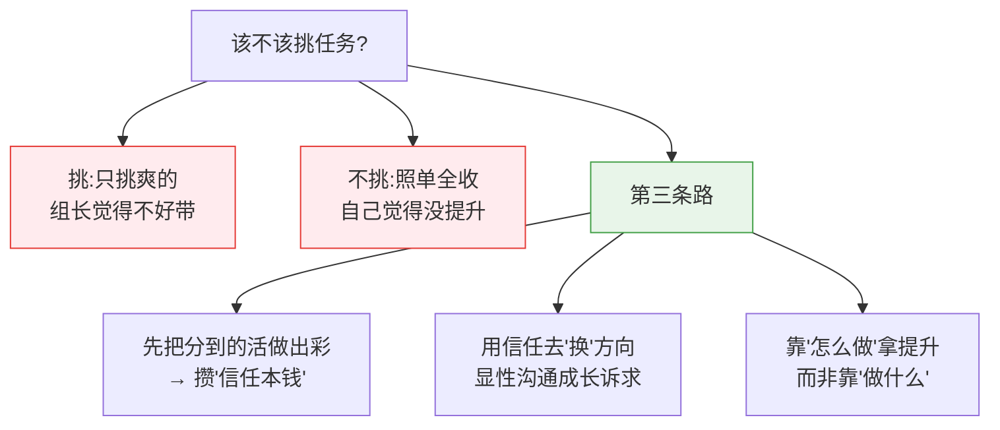

# 该不该挑任务:成长 与 被信任 的平衡

> 纠结:项目里做什么工作比较好?要不要挑任务?
> 挑任务,组长肯定觉得"不好带";不挑任务,又觉得自己没提升。
>
> 核心结论:**"挑 vs 不挑"是个假二选一。** 组长烦的不是"你想成长",
> 而是"你挑肥拣瘦"。正解是第三条路:**先用做好分内活攒信任,再用信任换方向,
> 同时靠"怎么做"而不是"做什么"来拿提升。**

---

## 一、先拆两个误解

**误解 1:组长讨厌"我想成长"。**
错。组长讨厌的是**只挑爽的、推掉脏活累活、不管团队需要**。
表达成长意愿不招人烦,挑三拣四才招人烦——这两件事别混为一谈。

**误解 2:提升 = 高大上的任务。**
错。提升更多来自**你怎么做**,而不是**做什么**。
同一个 CRUD,可以只交差,也可以顺手抽象、加监控、写清文档——后者就是提升。
很多"烂活"(救火、啃老系统、补文档)反而最容易被看见、最快建立信任,
而且"难啃"往往 = "成长快"。

---

## 二、第三条路

### 信任是议价的本钱
新人一上来就挑,没有本钱,所以显得"不好带"。
**先证明"什么活给你都放心",组长反而愿意把好活给你、也愿意听你的诉求。**
顺序:**先建立信任 → 再用信任换想做的方向。**

### 把"挑"变成不招人烦的"沟通意愿"
- 别说"这个我不想做",改说 **"我想往 X 方向发展,以后这类活可以多给我"** —— 表达意愿,不是拒绝。
- 接活时带偏好:**"这个我来,没问题;另外后面有 Y 类的我也想试试。"**
- 主动**认领**别人不想做但有价值的硬骨头 —— 既是团队最需要的,也常是成长最快的。
  把团队需要放前面,你的诉求才有人愿意接。

---

## 三、判断任务值不值得投入(两个维度)

| | **对我成长高** | **对我成长低** |
|---|---|---|
| **团队价值高** | 🟢 抢着做(理想) | 🟡 做好它 = 攒信任;再靠"怎么做"挤出提升 |
| **团队价值低** | 🔵 沟通争取 / 业余补 | ⚪ 尽量减少,能自动化就自动化掉 |

- **差任务的特征**:纯重复、无沉淀、谁来都一样、做完即弃。
- 注意:**右上角那格(团队需要的脏活)恰恰是新人最该接的** ——
  它换来信任,而信任是后面挑方向的通行证。
- 即使是"烂活"也能提升:把重复的**自动化**、把混乱的**标准化**、
  把没人懂的系统摸成自己当 owner —— 价值由"你怎么做"决定。

---

## 四、分阶段看

- **早期(新人 / 新团队 / 信任未建立)**:以建立信任为主,少挑、多接、把活做出彩。
- **站稳后(信任已建立)**:逐步主动塑造方向,显性表达成长诉求,争取高成长任务。

挑任务的"资格",是靠前一阶段挣来的。

---

## 五、和其他几篇的同一个根

这其实和 `职场按角色沟通复盘`、`夹在老板与产品之间的优先级冲突` **同根**:
都是 **"别默默吞,把诉求显性沟通出去,并翻译成对方关心的语言"**。

- 那里:把**风险 / 优先级**显性化,翻译成 PM / 老板关心的"进度与决策"。
- 这里:把**成长诉求**显性化,翻译成组长关心的"团队的活有没有人好好干"。

> 一句话:**先成为"什么活都放心交给你的人",你才有资格挑活;
> 而提升,藏在你怎么做每一件活里,不在任务的标签上。**
