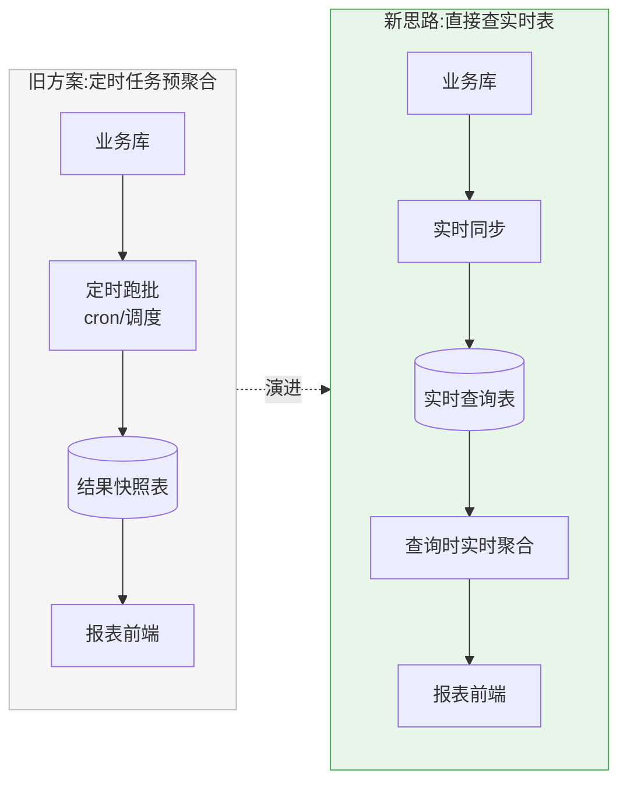
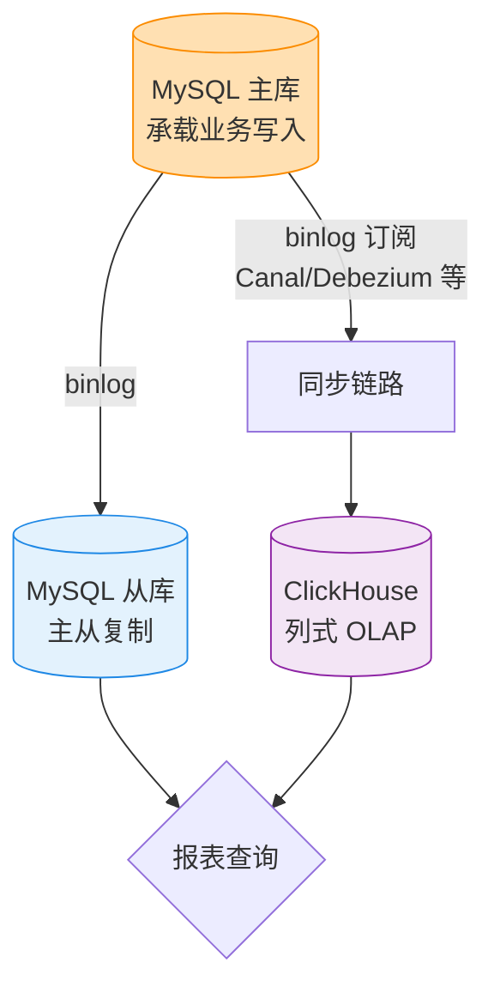
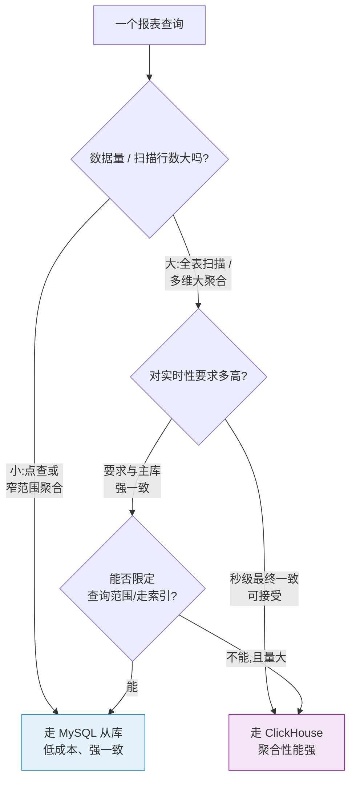
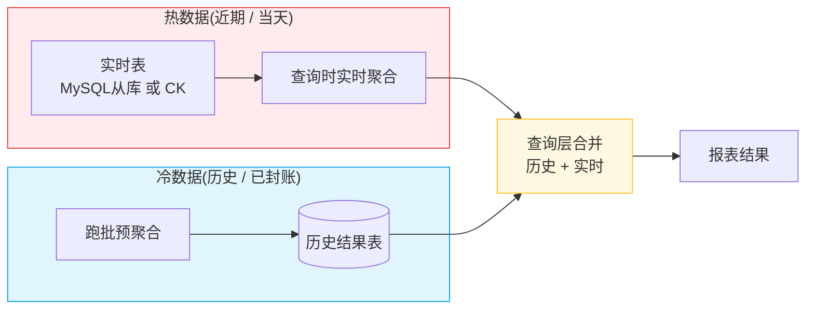
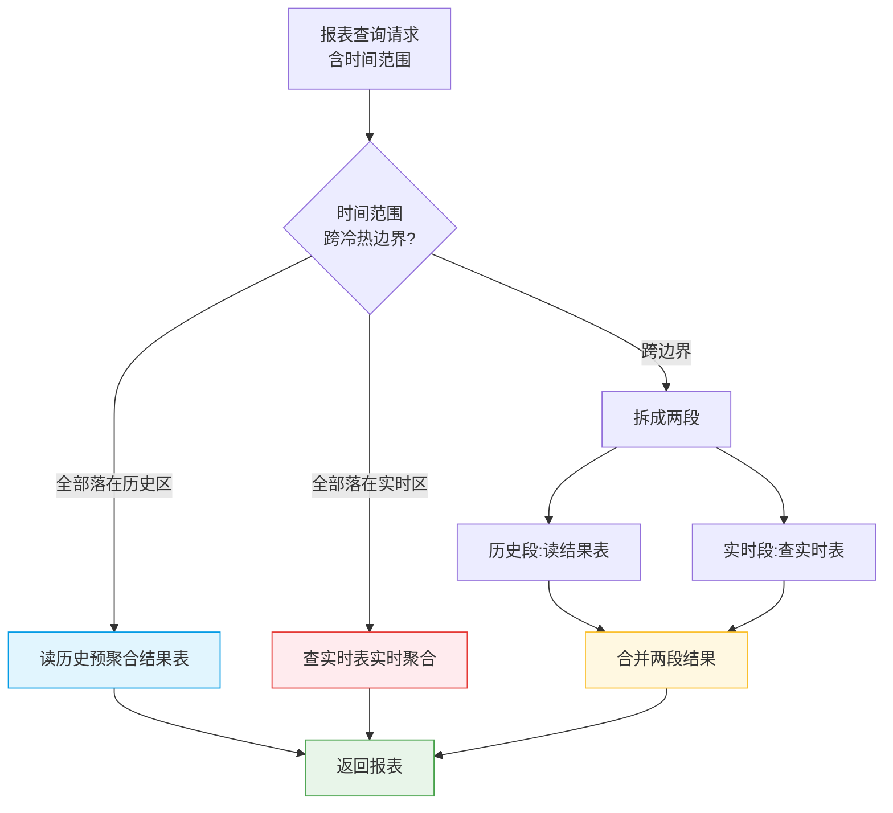
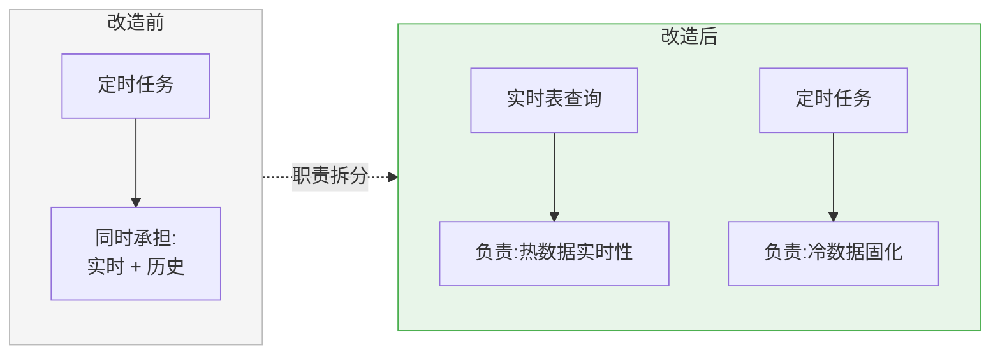
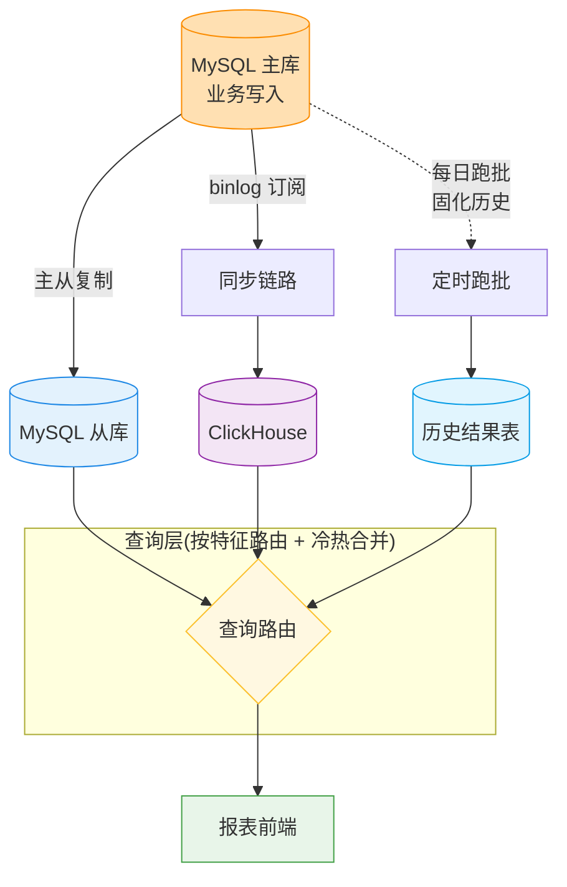

# 用实时表查询替代定时任务 —— 报表查询设计的思路探讨

> 这是一份「想法记录」,把这次讨论的演进过程沉淀下来:
> 从「定时任务跑批」到「直接查实时表」的动机,
> MySQL 从库与 ClickHouse(CK)两条路线的取舍,
> 以及实时报表 + 历史报表跑批的整体设计。
> 以流程图为主线,文字只做必要的补充。

---

## 1. 缘起:为什么想用「查实时表」替代「定时任务」

最初的报表是用**定时任务(cron / 跑批)**预先把数据聚合好,落到一张结果表里,
前端查的永远是「上一次跑批的快照」。这套方案能跑,但用久了痛点很明显:

- **实时性差**:数据要等下一个调度周期(小时级 / 天级)才更新。
- **任务多、链路长**:维度一多,跑批脚本越堆越多,补数、重跑、依赖编排都很重。
- **故障放大**:一个上游任务失败,下游一串报表全空,排查成本高。
- **资源浪费**:很多维度其实没人看,却天天在跑。

于是有了第一个念头 —— **能不能不预聚合,直接查实时表,把结果实时算出来?**

核心转变:**把「写时计算」(跑批时算好)改成「读时计算」(查询时再算)。**
代价是查询要扛得住实时聚合的压力 —— 这正是下面选型要解决的问题。

---

## 2. 实时表从哪来:MySQL 从库 vs ClickHouse

「查实时表」首先要回答一个问题:**这张实时表放在哪、用什么引擎?**
讨论里出现了两条路线 —— 直接查 **MySQL 从库**,或者把数据同步到 **ClickHouse**。

两条路线的共同前提是**不能压主库**,所以数据都要先从主库的 binlog 流出来。

### 2.1 两条路线的特点对比

| 维度 | MySQL 从库 | ClickHouse(CK) |
|------|-----------|----------------|
| 存储模型 | 行式,面向 OLTP | 列式,面向 OLAP |
| 擅长场景 | 点查、按索引的小范围聚合 | 大数据量扫描 / 多维聚合 |
| 实时性 | 主从延迟通常很低(秒级) | 取决于同步链路,通常秒级~分钟级 |
| 大表聚合性能 | 数据量大时明显吃力 | 强,压缩比高、向量化执行 |
| 写入/更新 | 天然支持事务更新 | 更新代价高,适合追加 |
| 改造成本 | 低(已有从库即可) | 需新增同步链路 + 运维 CK |
| 一致性 | 与主库强一致(复制延迟内) | 最终一致,依赖同步链路 |

### 2.2 选型的判断思路

不是「二选一」,而是**按查询特征路由**:

一句话总结取舍:
**小而精、要强一致 → MySQL 从库;大而广、重聚合分析 → ClickHouse。**

---

## 3. 报表查询设计:实时报表 + 历史报表跑批

真正落地报表时,发现「全部实时算」也不现实 ——
**历史数据已经固化、不再变化,每次都重算是浪费**;
而**当天/近期数据频繁变动,才真正需要实时**。

于是回到一个混合设计(本质是 Lambda 架构的思路):
**冷热分离 —— 历史走跑批预聚合,实时走实时表查询,查询层做合并。**

### 3.1 冷热分层

要点:

- **历史数据只跑一次**:某天数据封账后预聚合落表,以后直接读,不再重算。
- **实时数据按需算**:只对「热区间」做实时聚合,数据量小,压力可控。
- **分界线**:用一个时间边界(如「今天 00:00」或「最近 N 天」)切分冷热,
  避免重叠计算或漏算。

### 3.2 一次报表查询的路由流程

### 3.3 历史跑批的角色变化

注意:引入实时表**并没有完全消灭定时任务**,而是**给它重新定位**:

- 旧角色:跑批是**唯一**的数据来源,实时性全靠它,所以又多又重。
- 新角色:跑批只负责**把昨天及更早的数据固化成历史结果表**,
  跑一次、跑得稳,不再背实时性的包袱。

---

## 4. 整体架构串起来

把上面三段合并,得到端到端的视图:

---

## 5. 小结:这次讨论想表达的几个想法

1. **动机**:定时任务预聚合实时性差、维护重,想用「查实时表」替代,把「写时计算」变「读时计算」。
2. **实时表选型**:MySQL 从库 vs ClickHouse 不是二选一,而是按查询特征路由 ——
   小而精强一致走从库,大而广重聚合走 CK,共同前提是不压主库。
3. **报表设计**:全部实时不现实,采用冷热分离 ——
   历史跑批固化、实时表算热数据、查询层合并,定时任务从「全包」退回到「只管历史固化」。

> 后续可以再展开的点:冷热时间边界怎么定、CK 同步链路的一致性与去重、
> 查询层合并的口径对齐(避免重复/遗漏)、降级与缓存策略。
