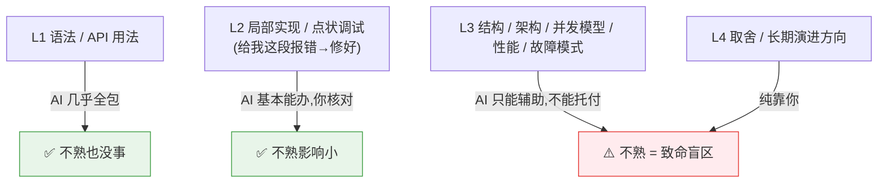

# AI 时代选 Java 还是 Go:语言选择的决策框架

> 一个想法:做项目选 Java 还是 Go?AI 编程已经能做很多了,但选语言还是选自己熟的更好。
> 关键顾虑:**选不熟悉的语言,后面出问题虽然能用 AI 排查,但"结构性"的问题不好判断。**
> 怎么看这件事?
>
> 核心结论:**AI 把"写得出来"变便宜了,却没把"判断得对"变便宜。**
> 语言选择应该押在"判断得对"那一层——也就是 AI 唯一帮不上你的地方。

---

## 一、把能力拆成四层,看 AI 覆盖到哪

**AI 大幅抬高了 L1–L2 的地板,却几乎抬不动 L3–L4。**
而"选不熟悉的语言"恰恰是在 L3–L4 上裸奔——AI 唯一帮不上你的那层。

---

## 二、为什么"结构性问题"是 AI 的盲区

点状 bug:有报错、有栈、范围小 → 喂给 AI 很好使。
结构性问题完全不同,它表现为:**能跑,但慢 / 偶发 / 泄漏 / 扛不住量 / 改不动。**

| 特征 | 为什么 AI 帮不上 |
|------|----------------|
| **难发现** | 没有报错,只是"怪怪的",你不会去问 |
| **难定位** | 散在多个文件 + 运行期行为里,你不知道该把什么喂给 AI |
| **难判断对错** | 就算 AI 给了结构建议,**你得有那层功力才能判断它对不对**;不熟只能盲信 |
| **不知道自己不知道** | goroutine 泄漏、连接池耗尽、GC 调优… 不熟的语言里你连"该问这个"都想不到,而 AI 只回答你问的 |

### 复合风险链

**在结构层,AI 不是减风险,而是放大你判断力的缺口。**

---

## 三、决策框架:三个问题排序

1. **利害 & 寿命**
   - 扔了就完的原型 / demo / 学习项目 → 随便选,正好拿不熟的来学。
   - 长期维护、线上要你兜底的系统 → **押在你能持有 L3 判断力的语言上。**
2. **问题契合度**:有些问题强契合某语言(见下),契合度高能省掉大量结构性麻烦。
3. **谁持有判断力**
   - 只有你 → 选你熟的。
   - 有能扛架构的资深兜 L3 → 可以借项目学不熟的语言。

> **默认结论:重要、长期的项目,选你能 hold 住结构判断的语言;把局部实现丢给 AI。**
> AI 是放大你判断力的杠杆,不是替你长出判断力。

---

## 四、Java vs Go 速查(契合场景 + 结构性坑)

| | 契合场景 | 结构性坑(不熟最容易栽) |
|---|---|---|
| **Go** | 高并发网络服务、云原生 / K8s 生态、CLI、轻量微服务、单二进制部署、启动快省内存 | goroutine / channel 泄漏、并发竞态、错误处理与 context 取消、生态不如 Java 厚 |
| **Java** | 复杂业务域、成熟生态(Spring 全家桶)、大数据 JVM 系、长期演进的大型系统、招人面广 | JVM / GC 调优、启动慢内存大、并发模型多(线程池 / 锁 / 响应式)更隐蔽、整体复杂度高 |

两条都能用 AI 写代码;**真正该押注的维度是"哪些结构性坑你能提前看见、出事能判断"。**

---

## 五、折中路径(想学新语言又怕翻车)

- **核心骨架用熟的语言**,新语言只用在低风险的边缘模块,逐步建立 L3 心智模型。
- **原型阶段用不熟的语言探路**,但别让"你判断不了结构"的语言上生产关键路径。
- 用 AI **主动学 L3**:不只让它写代码,让它讲"这个语言常见的内存/并发/故障坑是什么"——
  把它当老师补盲区,而不是当枪手替你扛判断。关键是**真的内化,不是复制粘贴。**

---

## 六、一句话总结

> **AI 让"写得出来"几乎免费,但"判断得对"依然要你自己长出来。**
> 选语言,就是选你愿意为之持有结构判断力的那一门;
> 局部交给 AI,结构留给自己——这才是不熟的语言最危险、也最该警惕的地方。

> 后续可展开:把"该语言常见结构性坑"整理成各语言的 checklist,作为出事时的自检清单。
