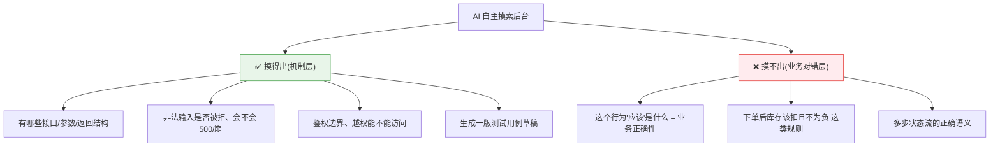

# AI 自主摸索后台业务来测试,可行吗?

> 命题:如果没有前端代码,直接把测试后台丢给 AI,让它自己去摸索业务、做测试,可行吗?
>
> 结论:**可行,但分层看——AI 摸得出"机制",摸不出"业务对不对"。**
> 适合当"探路 + 压测 + 用例起草机",不适合当"业务对错的裁判"。

---

## 一、先纠正一个前提:没有前端反而是好事

测后台业务,**走 API 直接测本来就比透过前端测更干净**(前端会引入 UI flakiness、噪音)。
所以"没有前端"根本不是障碍。真正的命题是后半句:**让 AI 自主摸索业务,行不行。**

---

## 二、关键:摸得出"机制",摸不出"业务对错"

这就是测试里的 **oracle problem(没有"标准答案"就无法判断对错)**:

- AI 能探出"接口长什么样、会不会崩、非法输入挡不挡"——**机制层,它很强。**
- 但"这个接口**本该**返回什么、库存**该不该**扣、流程**对不对**"——它没有业务预期(oracle),
  只能猜一个"看起来合理"的模型。而**"看起来合理"≠"真实业务规则",它会自信地把错的判成对的。**

> 同根于 [`AI时代选Java还是Go`](AI时代选Java还是Go-语言选择.md):
> AI 擅长 L1–L2(机制、局部),搞不定 L3–L4(结构、对错判断)。
> 没有 oracle,它的"摸索"就是在 L3 上裸奔。

---

## 三、想真能用,三个前提

1. **给地图**:OpenAPI / proto / 路由表 / 源码。没有入口,AI 乱撞效率极低还漏测;
   有 OpenAPI 它能系统化遍历(类似 Schemathesis 按 schema 生成用例的思路)。
2. **给 oracle(关键)**:PRD / 业务规则 / 期望输入输出样例。
   给了才能测"对不对",不给只能测"没崩"。
3. **给沙箱**:隔离测试环境 + 三方 mock + 可重置 DB(别让它真扣库存、发短信、扣款,更别指向生产)。
   —— 接上 [`本地自测工具箱`](本地自测工具箱-逼出隐藏bug.md)。

---

## 四、推荐姿势:AI 做"探索+压",人定"业务断言"

| 交给 AI | 留给人 |
|---------|--------|
| 接口发现、参数/边界 fuzz | 定义**业务正确性断言**(什么才算对) |
| 找 500 / 崩溃、鉴权越权探测 | **审校** AI 的理解,抓"自信地错" |
| 产出**测试用例草稿** | 决定哪些进回归 |

- **给它行动闭环**:能调 API + 读返回 + 读 DB/日志,AI 才能"动作→观察→修正"地真正摸索,而非空想。

---

## 五、一句话总结

> **让 AI 自主摸后台,适合当"探路 + 压力测试 + 用例起草机",不适合当"业务对错的裁判"。**
> 裁判这活,oracle 必须人来给。
