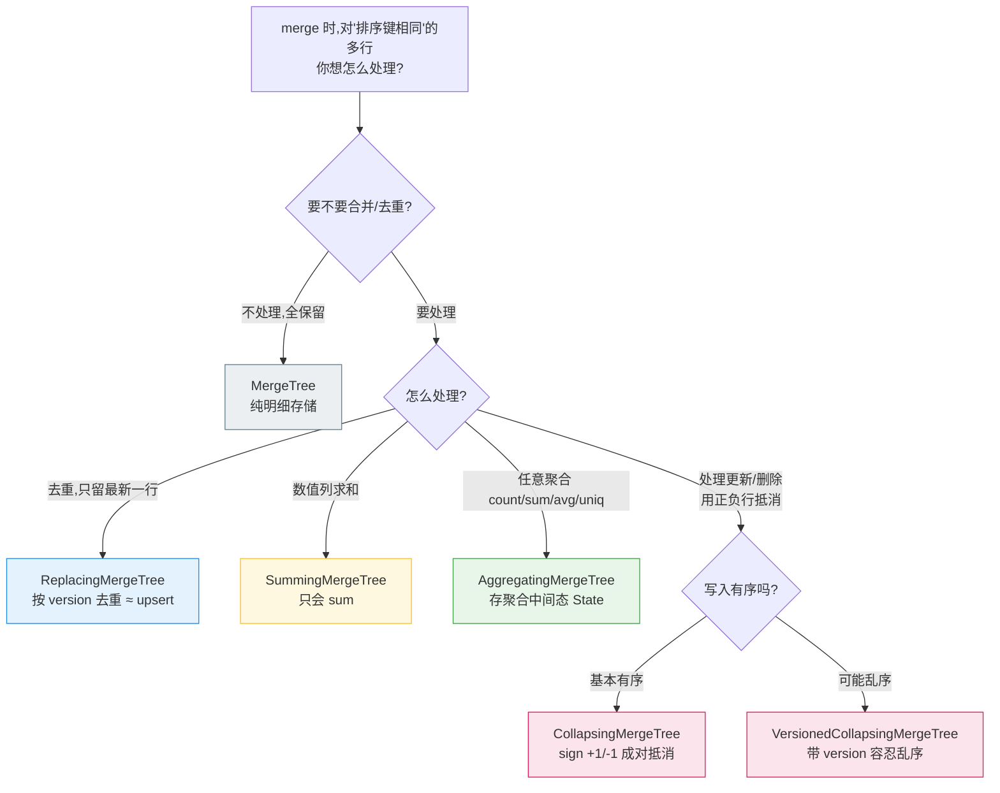

# ClickHouse MergeTree 家族:几种引擎到底差在哪

> 上一篇用到了 `AggregatingMergeTree`,这里把 ClickHouse 的 `*MergeTree` 系列讲清楚。
>
> **一句话抓住本质:这些引擎的区别,全集中在一件事 ——
> 「后台 merge 合并数据块时,对 *ORDER BY(排序键)相同* 的行做什么处理」。**
> 平时写入都是直接 append,区别只在"合并那一刻"。

---

## 一、一张决策图看懂选哪个



---

## 二、对比表

| 引擎 | merge 时对"排序键相同的行"做什么 | 典型用途 |
|------|--------------------------------|----------|
| **MergeTree** | 什么都不做,全部保留 | 存明细、日志、事件原始数据 |
| **ReplacingMergeTree** | **去重**,保留 version 最大(或最后写入)的一行 | 去重、类 upsert(同一主键最新状态) |
| **SummingMergeTree** | 把数值列**求和**合并成一行 | 简单 sum 预聚合 |
| **AggregatingMergeTree** | 用**聚合函数状态(State)**合并,支持任意聚合 | 物化视图多指标预聚合、大盘时段桶 |
| **CollapsingMergeTree** | 按 `sign`(+1/-1)**成对抵消**,实现"更新/删除" | 可变状态(如账户余额)的增量更新 |
| **VersionedCollapsingMergeTree** | 同上,但带 `version` 列,**容忍乱序写入** | 同上 + 数据可能乱序到达 |

> 另外:引擎名前面加 **`Replicated`**(如 `ReplicatedAggregatingMergeTree`)
> = 在上面逻辑之上**多一份副本复制**。这是"高可用"维度,和上面的"合并逻辑"维度正交,别混淆。

---

## 三、为什么大盘用 AggregatingMergeTree,而不是 Summing

- **SummingMergeTree** 只能做 `sum`。大盘往往要 count、sum、avg、去重数(uniq)等**多种**指标。
- **AggregatingMergeTree** 存的是**聚合中间态(State)**,能容纳任意聚合函数,而且——
  **State 可以再被合并(rollup)**:5 分钟桶的 State 再 `Merge` 一次就得到小时桶,不用回头扫明细。

```text
明细 → countState()/sumState()/uniqState() 写入 5m 桶
查询 → countMerge()/sumMerge()/uniqMerge()        ← 取出结果
rollup → 对 5m 桶的 State 再按小时 GROUP BY merge  ← 多粒度
```

---

## 四、最容易踩的坑:merge 是"最终一致",不是"立刻生效"

这几个会合并/去重的引擎,**合并发生在后台,时机不确定,也不保证全局只剩一行**
(不同数据块里的相同键,要等它们被 merge 到一起才合并)。所以**查询必须兜底**:

| 引擎 | 查询怎么拿到"正确结果" |
|------|----------------------|
| Replacing / Collapsing | 加 `FINAL`,或自己 `GROUP BY` + 取最新/`sum(sign)` 过滤 |
| Summing / Aggregating | 用 `sumMerge()`/`xxxMerge()` 或 `GROUP BY` 再聚合一次 |

> 记住:**写入≠已合并。别假设查的时候已经去过重/聚合好了,查询端永远再收一次口径。**

---

## 五、一句话总结

> **`*MergeTree` 的差异 = "merge 时对相同排序键的行怎么处理"。**
> 存明细用 MergeTree;去重用 Replacing;只求和用 Summing;多指标可 rollup 用 Aggregating;
> 要冲销更新用 Collapsing(乱序加 Versioned)。
> 而且合并是最终一致的,**查询端要用 FINAL / -Merge / GROUP BY 兜口径。**
