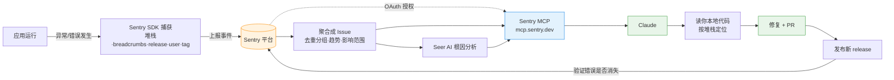
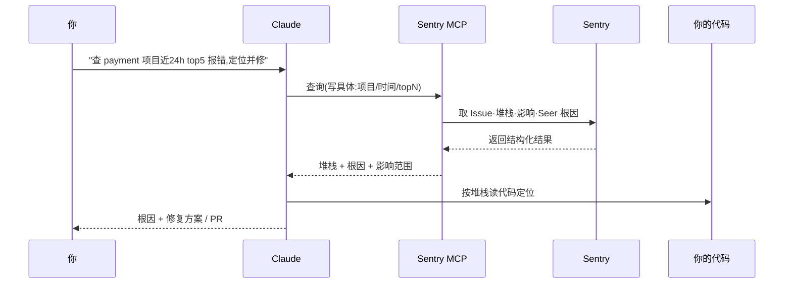

# Sentry 排错:线上报错的数据流转

> 这条流展示**线上报错怎么从应用一路流到 Claude 帮你定位修复**。
> 前提:应用已接 **Sentry SDK** 在上报(没上报就没数据可查)。
> 配套:[Claude/AI 生态工具选用速览](Claude-AI生态工具选用速览.md)、[防止线上出问题](防止线上出问题-测试环境测不出的怎么防.md)。

---

## 一、整体数据流转

**分环节看:**
1. **采集(应用端)**:出错时 SDK 自动抓**堆栈、breadcrumbs(出错前的操作轨迹)、release 版本、用户、tag**,上报到 Sentry。
2. **聚合(Sentry)**:把同类错误**去重分组成 Issue**,记录频率、趋势、影响用户数。
3. **根因(Seer)**:Sentry 的 AI 分析,给可能根因 + 修复建议。
4. **接入(MCP)**:Sentry MCP 经 **OAuth** 把这些数据暴露给 Claude 查询。
5. **排查(Claude)**:拉 Issue/堆栈/Seer 结果 → **对到你本地代码**定位到文件/行 → 给修复/PR。
6. **闭环**:发新 release → 回到 Sentry 看错误是否消失。

---

## 二、一次排查的交互时序

> 价值点:**报错 → 根因 → 代码定位 → 修复**在一个对话里串起来,不用在 Sentry 网页和 IDE 之间来回切。

---

## 三、注意

- **没装 SDK 就没数据**:先确保应用接了 Sentry(各语言 `@sentry/...`)在上报。
- **查询要具体**:"近24h top5 报错"可以,"show errors"太泛会失败。
- **数据敏感性**:错误事件可能含 PII(用户数据、请求体)——在 SDK 侧配好 **data scrubbing/脱敏**;MCP 走 OAuth 会读你的 Sentry 数据,按最小权限授权。
- **Sentry ≠ 通用日志**:它管**异常/错误 + 堆栈 + 根因**;普通 info/debug 流水日志归 ELK/Loki/CloudWatch。
- **自托管 Sentry**:Seer 等可能不可用。

---

## 一句话总结

> **应用出错 → SDK 抓堆栈上报 → Sentry 聚合成 Issue(+Seer 根因)→ MCP 授权给 Claude → Claude 对到代码定位修复 → 发版回 Sentry 验证。** 一条闭环把"线上报错"变成"对话里能修"。
