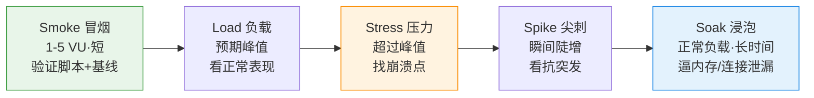

# k6 压测实操整理

> 用 k6 做并发/负载测试的实操笔记。选 k6 的理由:**脚本是 JS(AI 写/改顺手)、轻量、CLI 友好、结果好解析**,比 JMeter 的 XML 适合 AI 驱动。
> 配套:[本地自测工具箱](本地自测工具箱-逼出隐藏bug.md)、[防止线上出问题](防止线上出问题-测试环境测不出的怎么防.md)、[大数据场景](大数据场景的降风险与本地模拟测试.md)。

---

## 一、安装 & 跑起来

```bash
# 安装(任选)
brew install k6                  # macOS
# 或 apt / docker run grafana/k6

# 跑
k6 run script.js
k6 run --vus 50 --duration 1m script.js     # 命令行覆盖参数
k6 run -e BASE_URL=https://staging.x.com s.js # 传环境变量
k6 run --out json=result.json script.js       # 导出结果
```

## 二、最小脚本结构

```js
import http from 'k6/http';
import { check, sleep } from 'k6';

export const options = {
  vus: 50,          // 50 个虚拟用户(VU)
  duration: '30s',
};

export default function () {              // 每个 VU 循环执行这个函数
  const res = http.get('https://test.k6.io');
  check(res, {                            // 断言(不中断,只统计通过率)
    'status is 200': (r) => r.status === 200,
    'fast enough':  (r) => r.timings.duration < 500,
  });
  sleep(1);                               // think time,模拟用户间隔
}
```

核心概念:
- **VU**(virtual user):并发的虚拟用户;每个 VU 反复跑 `default` 函数。
- **iteration**:`default` 函数跑一遍。
- **check**:断言,**不会中断测试**,只统计通过率(用来看正确性)。
- **threshold**:**通过/失败的红线**(用来给测试下"过没过"的判定,CI 里会据此返回非零退出码)。

## 三、五种压测类型(用 stages 控制负载曲线)



用 `stages` 做爬坡(ramp up → 持平 → ramp down):

```js
export const options = {
  stages: [
    { duration: '1m', target: 100 },  // 1分钟爬到100 VU
    { duration: '3m', target: 100 },  // 维持3分钟
    { duration: '1m', target: 0 },    // 1分钟降回0
  ],
  thresholds: {
    http_req_duration: ['p(95)<500'], // 95分位 < 500ms,否则判失败
    http_req_failed:   ['rate<0.01'], // 错误率 < 1%
  },
};
```

## 四、VU 模型 vs 到达率模型(重要)

- **VU 模型(closed,默认)**:固定并发用户数。响应变慢时,发压速率会跟着降——**掩盖问题**(coordinated omission)。
- **到达率模型(open,arrival-rate)**:**固定每秒请求数(RPS)**,不管响应多慢都按这个速率发——**更贴近真实流量**,推荐压后端接口用。

```js
export const options = {
  scenarios: {
    constant_load: {
      executor: 'constant-arrival-rate',
      rate: 200, timeUnit: '1s',   // 固定 200 RPS
      duration: '2m',
      preAllocatedVUs: 100, maxVUs: 300,
    },
  },
};
```
> 想要"固定 QPS"就用 `constant-arrival-rate` / `ramping-arrival-rate`;想模拟"N 个在线用户"就用 VU 模型。

## 五、参数化(别所有请求都打一样的数据)

```js
import { SharedArray } from 'k6/data';
const users = new SharedArray('users', () => JSON.parse(open('./users.json')));

export default function () {
  const u = users[Math.floor(Math.random() * users.length)];
  http.post('https://api.x.com/login', JSON.stringify(u));
}
```
> 呼应大数据篇:**数据分布要真实**(别只打一个热点 key),否则压不出真问题。

## 六、结果怎么看

| 指标 | 含义 | 关注 |
|------|------|------|
| `http_req_duration` | 请求耗时 | 看 **p95 / p99**,不是平均值 |
| `http_req_failed` | 失败率 | 错误率红线 |
| `http_reqs` | 总请求数 + **RPS** | 实际吞吐 |
| `vus` / `vus_max` | 并发用户数 | |
| `iterations` | 迭代次数 | |
| `checks` | 断言通过率 | 正确性 |

> 看 **分位数(p95/p99)** 而非平均——平均会被掩盖长尾。

## 七、几个必须避开的坑

1. **从单机/小机器发大压**:客户端自己先成瓶颈(CPU/网络),数字全错 → 用够格的压测机,**别在云沙箱发大压**(资源 + 出网受限)。
2. **只看客户端数字**:一定**同时盯服务端**(CPU/内存/连接池/DB 慢查询/EXPLAIN)——瓶颈在哪要两头看。
3. **没设 thresholds**:那就没有"过/不过"的判定,沦为看个热闹。
4. **coordinated omission**:压后端接口优先用到达率模型。
5. **数据不真实**:参数化 + 真实分布,别全打一个值/一个热点。
6. **连接复用/缓存**:注意 keep-alive、CDN/缓存会让结果偏乐观。

## 八、跑法建议

- 本地写脚本 + 小规模冒烟(几个 VU)验证脚本正确;
- 真压测从**预发 / 专用压测机**对着**接近真实量级**的环境发;
- 接 CI:thresholds 不过 → 退出码非零 → 卡住发布;
- 要可视化:`--out` 接 Grafana / k6 Cloud 看实时曲线。

---

## 一句话总结

> **k6 = JS 写脚本、CLI 跑、thresholds 判过没过。** 选对负载类型(冒烟/负载/压力/尖刺/浸泡),压后端用到达率模型固定 RPS,看 p95/p99 和错误率,**客户端和服务端两头一起看**,大压测别在小机器/云沙箱发。
