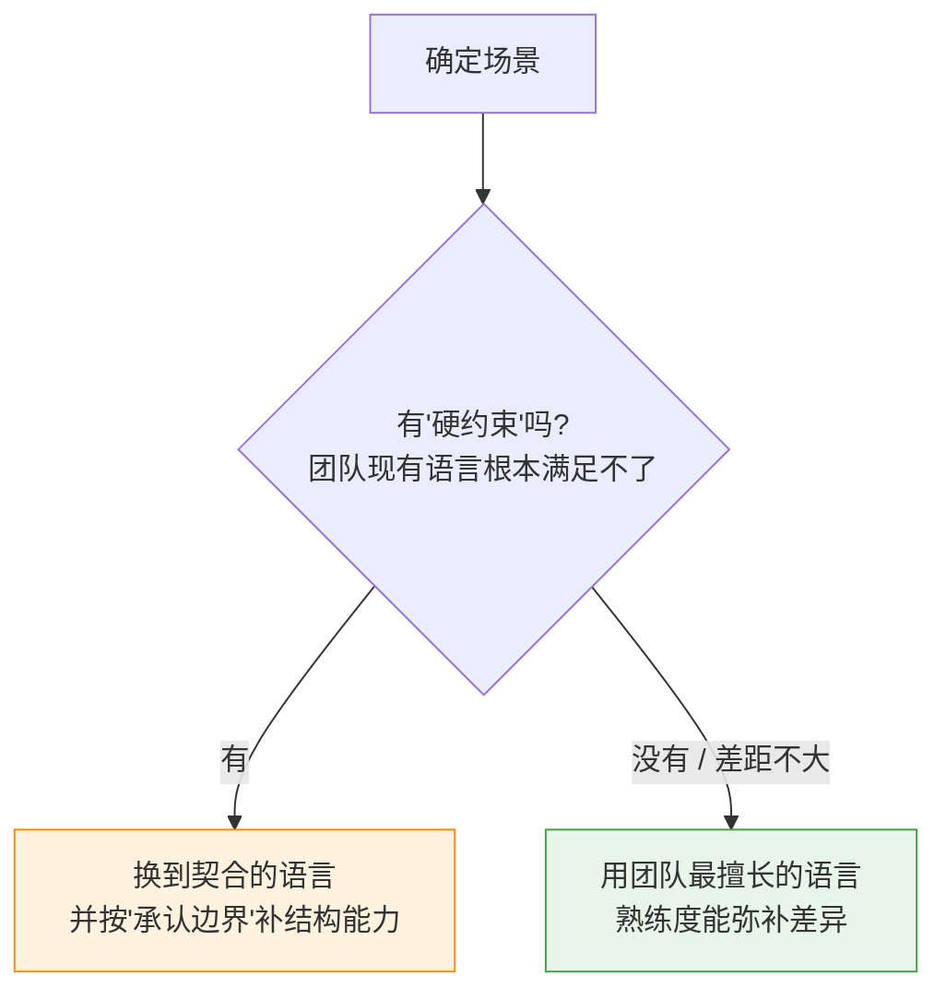

# 什么场景用什么语言?还是看团队擅长?

> 问题:不同场景该用什么语言?还是主要看团队擅长什么?
>
> 核心结论:**语言选择不是"找最适合场景的语言",而是"在场景的硬约束内,选团队能 hold 住的那门"。**
> 默认看团队擅长,只有场景的**硬约束**才能推翻它。
> (这是 [选 Java 还是 Go](AI时代选Java还是Go-语言选择.md) 从两门语言推广到通用判断。)

---

## 一、天平模型:团队熟悉度 vs 场景契合度

- **大多数项目,团队熟悉度更重**:它决定交付速度、可维护性、出事能不能排查
  (尤其是 **L3 结构判断**)、以及招人。
  **一门"不完美但吃透"的语言,通常打败"完美契合但没人懂"的语言。**
- **只有出现"硬约束"且团队语言满足不了时,场景才一票否决熟悉度。**

**硬约束清单**(满足不了就必须换):
延迟 / 吞吐(实时交易、游戏服务器)、平台(iOS 基本得 Swift)、
生态(做 ML 几乎绑定 Python 系)、无 GC / 内存安全(系统级)、特定并发模型。
**差距大到这个程度才换,否则选熟的。**

---

## 二、场景 → 自然契合的语言(参考,非强制)

| 场景 | 自然契合 | 为什么 |
|------|----------|--------|
| 高并发网络服务 / 微服务 / 云原生 / CLI | **Go** | 协程、单二进制、启动快、K8s 生态 |
| 复杂业务域 / 企业系统 / 大数据 / 长期大型 | **Java / Kotlin** | Spring 生态成熟、强类型、JVM、招人广 |
| AI/ML / 数据科学 / 脚本 / 快速原型 | **Python** | numpy/pandas/pytorch 生态、开发快 |
| 前端 / 全栈 / 实时交互 | **TypeScript** | 浏览器唯一、Node 生态、全栈统一 |
| 系统级 / 高性能 / 内存安全 | **Rust** | 无 GC、内存与并发安全 |
| 极致性能 / 底层 / 嵌入式 | **C / C++** | 贴近硬件、零开销 |
| 移动端 | **Swift / Kotlin** | 平台原生 |
| 高并发低延迟 / 电信级容错 | **Elixir / Erlang** | actor 模型、热更新、容错 |

> 这些是"自然契合",不是"唯一答案"。契合度差距不大时,团队熟悉度优先。

---

## 三、三条补充判断

1. **多语言(polyglot)有代价**:不同服务用不同语言可以,但碎片化会推高运维、招人、
   上下文切换成本。"团队擅长"其实也在为**收敛技术栈**投票 —— 别为局部最优牺牲整体。
2. **AI 不改变这个结论**:AI 降低了"用不熟语言**写代码**"的成本(L1-L2),
   但没降低"**结构判断**"的成本(L3-L4)。关键长期系统仍要押在团队能 hold 住结构的语言。
3. **别只看"现在爽"**:选型看 3 年后 —— 维护、迭代、招人,都是熟悉度的复利。

---

## 一句话总结

> **不是"找最适合场景的语言",而是"在场景的硬约束内,选团队能 hold 住的那门"。**
> 默认看团队擅长,只有场景的硬约束才推翻它。
