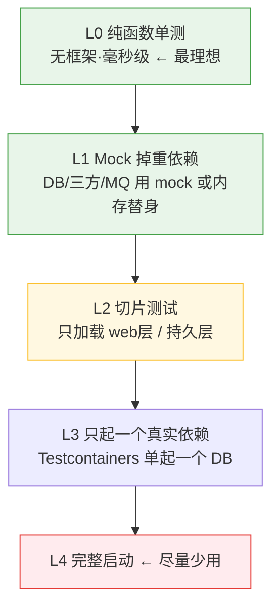
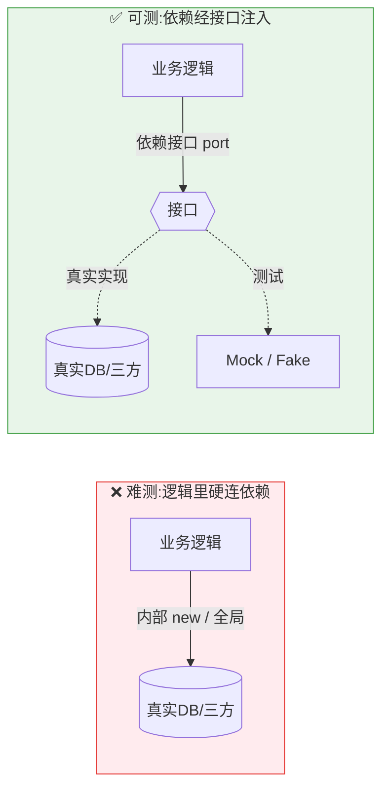

# 大项目不全量启动测单功能 & 如何让项目支持 mock 测试

> 命题:项目大、启动耗时耗资源,怎么只测**单个功能**而不必启动整个项目?
> 进一步:怎么让项目**本身就支持 mock 测试**?
>
> 核心判断:**"必须启动整个项目才能测一个功能",本身是个信号 —— 业务逻辑和框架/IO 耦合太紧。**
> 两条路:**治标**(只启动需要的那一小块)、**治本**(解耦,让功能脱离框架直接被调)。

---

## 一、从轻到重的测试阶梯

越往上层(L0/L1)挪,"启动整个项目"就越不需要发生。

---

## 二、治标:不启动全项目也能测的招

1. **只跑那一个测试,缩小编译+执行范围**
   - Go:`go test -run TestXxx ./pkg/foo`(只编译涉及的包,天生快)
   - Java:`mvn -Dtest=类名#方法 test`,或 IDE 点单个方法运行/调试
   - Python/Node:`pytest path::test`、`jest -t "名字"`
2. **Mock 掉重依赖**:用 mock 框架替换 DB / 下游 / MQ;或**内存替身**(H2/SQLite 内存库、embedded redis)。
3. **切片测试(只加载需要的那层)** —— Spring 尤其有用
   - `@WebMvcTest` 只起 Web 层 + `@MockBean` 掉 service(不加载完整 ApplicationContext)
   - `@DataJpaTest` 只起持久层 + 内存库
   - `spring.main.lazy-initialization=true` 只初始化用到的 bean
4. **在"端点"层面测,但不起真服务器**
   - Spring:**MockMvc / WebTestClient(standalone)**,直接喂请求给 Controller,不绑端口、不连库
   - Go:**httptest**,只拉起那个 handler
5. **写个一次性入口直接调**:临时 `main()`、scratch 测试、REPL(`go test`、jshell、`python -i`、node REPL)。
6. **确实需要真 DB 但不要整个应用**:Testcontainers **只起那一个 Postgres**,而不是把整套服务拉起来。

---

## 三、治本:让项目"天生可 mock / 可单测"

上面的招能不能用,取决于代码结构。根因解法是**可测性设计 —— 给依赖留出"接缝"(seam),让它可被替换。**

### 核心五原则
1. **依赖注入(DI)**:依赖从构造器/参数传入,**不在内部 `new` / 全局获取**。测试时传 mock。
2. **面向接口编程**:对接口/抽象编码,而非具体实现。mock 接口即可。
3. **把"不可控的东西"也注入**:时间(Clock)、随机数、UUID、当前用户、环境变量。
   别直接 `time.Now()` / `new Date()` / `Math.random()` —— 否则测试无法稳定、无法复现。
4. **把 IO 推到边界(六边形 / 端口-适配器)**:
   核心业务逻辑**零框架依赖**;DB/HTTP/MQ 都在 adapter 层、通过 port 接口调用 → 测试时 mock port。
5. **避开可测性杀手**:静态方法、单例、全局可变状态、构造函数里做重活、隐藏的 `new`、硬编码的第三方调用。
   这些都让依赖**没法被替换**。

---

## 四、Mock 的层次与各语言工具

| 层次 | 做什么 | 工具举例 |
|------|--------|----------|
| 进程内 mock | 替换对象/接口的行为 | Mockito(Java)、gomock/mockery/testify(Go)、unittest.mock/pytest-mock(Py)、jest.mock/sinon(JS) |
| 内存替身 / fake | 用轻量真实现替代 | H2/SQLite 内存库、in-memory repo、sqlmock |
| 外部服务 mock | 模拟三方 HTTP | WireMock/MockServer/Prism、responses/respx(Py)、nock(JS) |
| 故障注入 | 模拟超时/抖动 | toxiproxy(见工具箱篇) |
| 时间/随机 | 控制时钟 | freezegun(Py)、libfaketime、注入 Clock |

---

## 五、Mock 的陷阱(别滥用)

- **过度 mock**:把自己核心逻辑也 mock 掉 → 测试和实现死耦合,一重构全红,且测不到真问题。
- **mock 偏离真实**:mock 说成功,真实却会失败 → 假绿灯。
- **原则**:
  - **只 mock 边界**(外部、慢、不确定的依赖),不 mock 自己的核心逻辑;
  - 能用 **fake / 内存替身** 就别用 mock;
  - 用 **契约测试(Pact)** 兜住"mock 与真实漂移"。

---

## 六、存量项目改造(没法一步到位)

1. **找接缝**:把硬依赖抽成接口、把内部 `new` 提到构造器参数。
2. **包裹法**:给难测的静态/第三方调用包一层自己的 adapter 接口,测自己的接口。
3. **增量推进**:新代码遵循可测性原则;旧代码"改到哪、测到哪",别想一次重构完。

---

## 七、一句话总结

> **临时提速靠"只起需要的部分"(切片 + mock + 单测运行);
> 长期提速靠"把逻辑从框架里解耦出来"(DI + 接口 + IO 推到边界)。**
> 很多测试效率问题,根子在结构(耦合/可测性),不在工具 —— 工具治标,结构治本。
