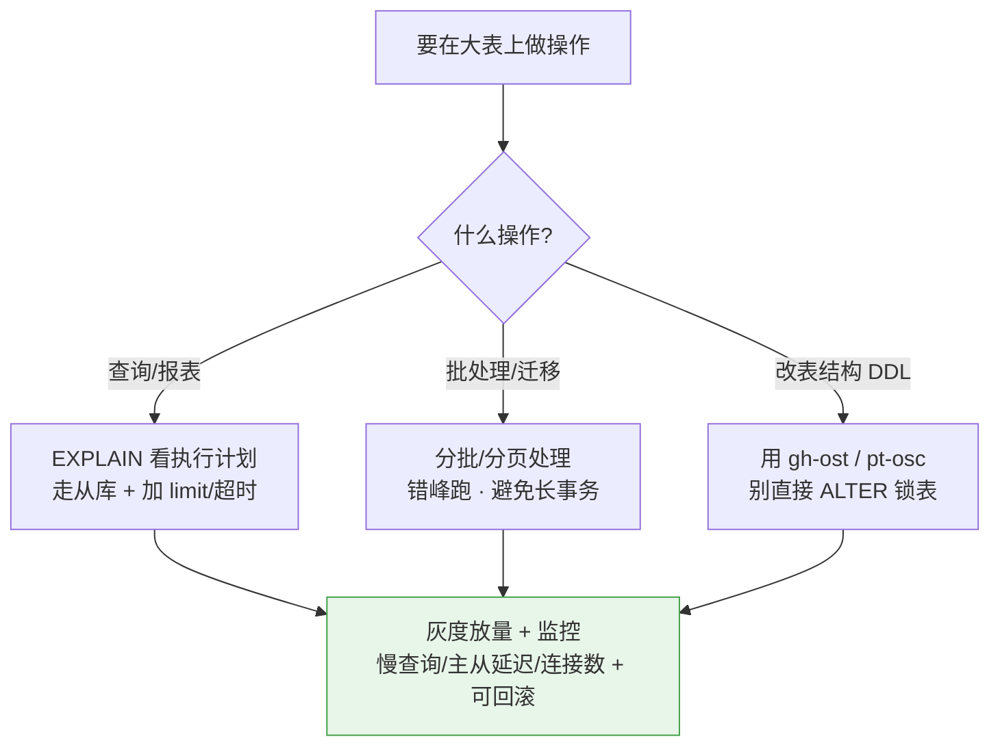
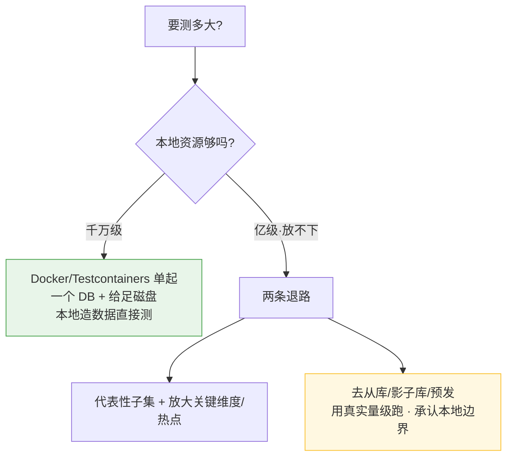

# 大数据场景:如何降风险 & 本地怎么模拟大数据测试

> 背景:线上和测试环境数据量都比较大,改动 / 查询 / 批处理跑在大表上风险高。
> 怎么减少风险?要不要提前找 DBA 问数据量?本地又怎么模拟大数据来测?
>
> 核心思路:**先把"数据量/数据画像"这个未知变成已知(找 DBA),再针对性降风险,
> 并用"接近真实量级和分布"的数据去验证 —— 别用玩具数据骗自己。**
> 这其实还是那条主线:**把未知风险提前暴露,变成可规划的已知。**

---

## 一、找 DBA 要哪些数据(关键!别只问"多大")

光知道"很大"没用。你要的是一份能据此做方案判断的**数据画像**:

| 要什么 | 为什么关键 | 怎么影响你的方案 |
|--------|-----------|-----------------|
| **行数 + 表/索引大小** | 数量级定方案 | 百万随便查;千万要走索引;亿级要分批/走从库 |
| **增长速率(日/月增量)** | 现在能跑 ≠ 未来能跑 | 判断方案寿命,是否需要分区/归档 |
| **现有索引(列、联合索引顺序)** | 决定查询能否命中 | 你的 where/order by 能不能走上索引 |
| **数据分布 / 倾斜(热点 key、最大单账号占比)** | 倾斜是性能杀手 | 是否存在慢点、是否要对热点特殊处理 |
| **字段基数 cardinality** | 决定索引选择性 | 低基数列(如状态)加索引基本没用 |
| **读写比例 + 峰值 QPS + 峰值时段** | 决定能不能碰、何时碰 | 批处理错峰、读走从库 |
| **是否有只读从库 + 主从延迟** | 能否分流 | 把查询/批处理引到从库,别压主库 |
| **大事务 / 复制延迟容忍** | 决定批大小 | 批处理一次处理多少行不拖垮从库 |
| **慢查询日志 / 已知慢 SQL** | 已知雷区 | 避开或先优化 |
| **资源水位(CPU/IO/连接数/磁盘)** | 还有多少余量 | 评估你的操作会不会压垮 |
| **分库分表 / 分区情况** | 查询要带分片键 | 不带分片键会扫所有分片,灾难 |
| **备份 / 回滚机制** | 出事能否恢复 | 决定操作的可逆性与胆量 |

> 提前问 DBA 是**最便宜的保险**:把"不知道数据有多大/多歪"这种**未知的未知**,
> 变成能提前规划的已知。

---

## 二、降风险的手段(按操作类型)



1. **EXPLAIN 先行**:上线前确认走索引、没有全表扫描 / filesort / 临时表落盘。
2. **分批,别一次性全量**:主键分段或游标切块,避免长事务、内存爆、超时。
3. **走从库 + 错峰**:读操作引到只读从库;批处理放低峰期。
4. **加 limit / 超时 / 限流**:防止单个查询跑飞拖垮整库。
5. **大表 DDL 用 online 工具**(gh-ost / pt-online-schema-change),别裸 `ALTER` 锁表。
6. **灰度 + 可观测 + 可回滚**:小范围先放,盯慢查询、主从延迟、连接数、磁盘;出事能秒退/降级。

---

## 三、本地怎么模拟大数据测试

### 两条路线,先选对
| | 自己造数据 | 脱敏的生产快照 |
|---|---|---|
| 真实度 | 一般(分布要自己设计) | 最高(倾斜/基数天然真实) |
| 成本/合规 | 低、无隐私问题 | 需脱敏、注意合规 |
| 适用 | 没生产权限、或要造极端量 | 有权限且能脱敏时,首选 |

### 快速造大数据(按"快"排,别用 faker 逐条插)
- **❌ 最慢**:应用层 Faker 一条条 insert,造千万行等到天荒地老。
- **✅ DB 原生膨胀(最快)**
  - PostgreSQL 一条 SQL 造千万行:
    ```sql
    INSERT INTO orders(user_id, amount, created_at)
    SELECT (random()*100000)::int,
           (random()*1000)::numeric(10,2),
           now() - (random()*365)::int * interval '1 day'
    FROM generate_series(1, 10000000);
    ```
  - MySQL 自膨胀翻倍(反复执行,行数 ×2,几次上千万):
    ```sql
    INSERT INTO t SELECT NULL, ... FROM t;   -- 跑 n 次 ≈ 2^n 行
    ```
    (MySQL 8 也可用 recursive CTE 生成序列再插入。)
- **✅ 批量导入(其次快)**:脚本生成 CSV,再 `LOAD DATA INFILE`(MySQL)/ `COPY`(PG),
  比逐条 insert 快几个数量级。
- **✅ 压测工具备数据**:`sysbench prepare`、`pgbench -i -s 1000` 一键铺大表,顺带能压测。

### 关键:量大还不够,分布要"真"
均匀随机的数据测不出真问题。重点造出:
- **数据倾斜/热点**:让少数 key 占大比例,例如 50% 订单挂到 user_id=1:
  ```sql
  CASE WHEN random() < 0.5 THEN 1 ELSE (random()*100000)::int END
  ```
- **真实的基数 / null 比例 / 字符串长度分布**(枚举别只有一种值)。
- **时间分布向近期倾斜**(冷热数据,呼应 [实时报表查询设计](实时报表查询设计.md))。
- **保持外键/关联完整性**,否则 join 测不准。

> 小表的 `EXPLAIN` 和大表完全不同 —— 优化器在小表上可能"看着没问题"。
> **必须在接近真实量级和分布的数据上看执行计划。**

### 本地扛不住亿级怎么办


- 用 Testcontainers / docker **只起一个数据库**(别起整个应用),给够磁盘,本地造千万级足够暴露大部分问题。
- 真要亿级且放不下:别硬扛 —— 用"子集 + 放大热点"近似,或直接去影子库/从库/预发用真实量级验证。**承认本地有边界,也是降风险。**

### 有了大数据,重点测这些
- **EXPLAIN**:走没走索引、有没有全表扫描 / filesort / 临时表落盘。
- **慢查询日志** + 查询耗时随数据量的变化趋势。
- **批处理**:分批是否生效、内存会不会爆、长事务/锁。
- **并发 × 大数据一起压**:连接池耗尽、锁等待(配 k6 / sysbench)。

---

## 四、最大的坑:测试环境数据量 ≠ 线上

最容易**假绿灯**的地方:
- 测试环境**量级偏小** → 查询在测试飞快,一上线全表扫描拖垮库。
- 测试环境**量够但分布不真实**(没热点/倾斜) → 一样测不准。

对策:用**脱敏生产快照**,或**造贴近真实量级 + 分布**的数据(倾斜一定要造出来)。
—— 接上 [本地自测工具箱](本地自测工具箱-逼出隐藏bug.md):**用真实量级/真实流量去撞,而不是用玩具数据自我安慰。**

---

## 五、一句话总结

> **第一步:找 DBA 要"数据画像"(不止行数),把未知变已知;
> 第二步:EXPLAIN + 分批 + 走从库错峰 + 灰度可回滚,针对性降风险;
> 第三步:本地用 DB 原生膨胀/批量导入造"量级真、分布真"的数据来验证,放不下就退到影子库。**
>
> 核心:**"分布真实"比"行数大"更重要;别用玩具数据骗自己。**

> 后续可展开:把造数据脚本沉淀成项目里可复用的 `seed-large-data` 工具;
> 整理一份"上线大表操作前自检清单"。
