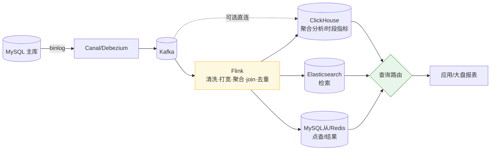
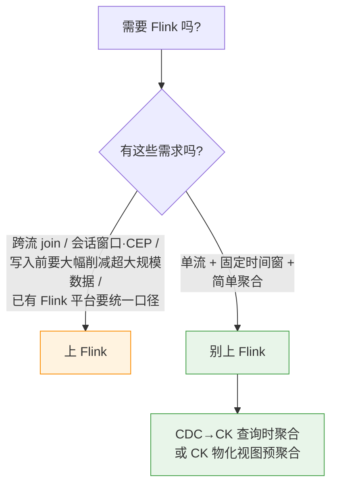
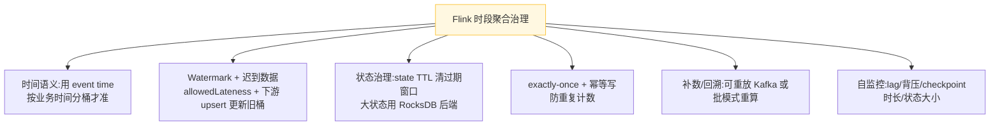

# 实时查询架构:CK / MySQL / ES 怎么分工,要不要上 Flink

> 现状:已经有 ClickHouse、MySQL、Elasticsearch。想做**数据实时查询**、以及
> **大盘监控按时段(如每 5 分钟)记录指标**。
> 问题:要不要引入 Flink?怎么和现有框架配合?大盘分桶聚合放哪做?
>
> 两个核心结论:
> 1. **Flink 不是"查询引擎",是"实时计算引擎"** —— 它不对外查询,只是把数据实时加工后
>    写进 CK/ES/MySQL,真正对外查询的还是这三个存储。
> 2. **大盘按时段(5 分钟)指标,优先用 ClickHouse(物化视图 / 查询时聚合),不上 Flink。**

---

## 一、各组件的角色分工

| 组件 | 定位 | 负责的查询 |
|------|------|-----------|
| **MySQL(从库)/ Redis** | OLTP / KV,强一致、最新状态 | 点查、查最新值、按主键/索引 |
| **ClickHouse** | OLAP 列存,大规模聚合 | 报表、多维聚合、时段指标、明细分析 |
| **Elasticsearch** | 倒排索引 | 全文检索、灵活多条件筛选 |
| **Flink** | 实时**计算**层(不对外查询) | 清洗 / 打宽 / 窗口聚合 / 多流 join / 去重 |
| **Kafka** | 缓冲解耦 | 承接 CDC、给 Flink 削峰 |

---

## 二、典型架构(数据怎么流)



查询侧**按类型路由**(延续 [实时报表查询设计](实时报表查询设计.md) 的"按查询特征路由"):
点查走 MySQL/Redis、聚合/时段指标走 CK、检索走 ES。

---

## 三、到底要不要 Flink?(读时计算 vs 写时计算)

回到第一篇的核心取舍:

- **读时计算(轻)**:CDC 把数据原样同步进 CK/ES,**查询时再聚合**。简单,中等量够用。
  **很多场景到这步就够,不用 Flink。**
- **写时计算(重)**:用 Flink / CK 物化视图**预聚合**好,查询只读结果。适合高 QPS、复杂聚合、超大量。



> **别为了"实时"上 Flink。** Flink 要带上 Kafka + checkpoint 状态后端 + 集群运维 +
> watermark/迟到/状态TTL 一整套治理成本。先问"简单同步 + 查询时聚合 / CK 物化视图"能不能满足,不能再逐级加重。

---

## 四、大盘按时段指标(如 5 分钟分桶)→ 放 CK 做

5 分钟分桶 = **单流 + 固定时间窗 + 简单聚合**,正是 ClickHouse 的主场。两种做法按量级选:

### 做法 A:查询时聚合(最简单,优先)
明细原样写进 CK,查询时分桶:
```sql
SELECT toStartOfInterval(ts, INTERVAL 5 MINUTE) AS bucket,
       count() AS cnt, sum(amount) AS gmv
FROM events
WHERE ts >= now() - INTERVAL 6 HOUR
GROUP BY bucket ORDER BY bucket;
```
只要明细量 CK 扛得住、大盘刷新 QPS 不高,**这步就够,零额外组件**。

### 做法 B:物化视图预聚合(量大 / 高频再上)
```sql
CREATE TABLE dash_5m (
  bucket DateTime,
  cnt AggregateFunction(count),
  gmv AggregateFunction(sum, Decimal(18,2))
) ENGINE = AggregatingMergeTree ORDER BY bucket;

CREATE MATERIALIZED VIEW dash_5m_mv TO dash_5m AS
SELECT toStartOfInterval(ts, INTERVAL 5 MINUTE) AS bucket,
       countState() AS cnt, sumState(amount) AS gmv
FROM events GROUP BY bucket;

-- 查询
SELECT bucket, countMerge(cnt) AS cnt, sumMerge(gmv) AS gmv
FROM dash_5m GROUP BY bucket ORDER BY bucket;
```

### "再聚合":多粒度 rollup 是 CK 强项
5 分钟桶要 rollup 成小时/天,**对 State 再 merge 一次即可,不用重算明细**:
```sql
SELECT toStartOfHour(bucket) AS h, countMerge(cnt), sumMerge(gmv)
FROM dash_5m GROUP BY h;
```
`AggregatingMergeTree` 存的是"半成品聚合状态(State)",可一层层往上再聚合 ——
「5 分钟 → 小时 → 天」一套表搞定。

### 两个必须注意
1. **迟到数据**:CK 物化视图是 append,迟到明细生成同 bucket 的新 State 行,`Merge` 时自动合并
   —— **天然支持迟到更新,不用 upsert**(前提是迟到明细还会写进来)。
2. **重复计数**:CDC 是 at-least-once,明细可能重复时,在明细层用 `ReplacingMergeTree` 按唯一键去重,否则桶里多算。

---

## 五、如果确实要用 Flink,治理抓这几条



---

## 六、无论哪种方案,大盘"按时段"都要处理的共性坑

1. **时区 / 时间语义**:按**业务时间(event time)**分桶,别用写入时间,否则跨天/延迟全错位。
2. **迟到 / 乱序**:窗口关了还有迟到数据 → 桶要能被更新(CK 靠 State 自动合并 / Flink 靠 allowedLateness)。
3. **幂等去重**:防重复计数(唯一键 / 版本)。
4. **补数 / 回溯**:某时段算错要能重算。
5. **桶粒度 + 多粒度 rollup**:5m / 1h / 1d 怎么分层。

---

## 七、一句话总结

> **Flink 是实时计算、不是实时查询;查询永远落在 CK/ES/MySQL。**
> 大盘 5 分钟分桶这种"单流 + 固定窗 + 简单聚合",CK(查询时聚合起步,量大再上物化视图 +
> State 再聚合做 rollup)就够了。**Flink 留给跨流 join、复杂窗口、超大规模预削减这些 CK 做不了的场景。**
> —— 还是那句:别为了"实时"两个字,付不该付的架构成本。

> 后续可展开:CK 物化视图的资源/合并(merge)开销治理;多粒度桶的存储与过期策略;
> 大盘查询的缓存与降级。
