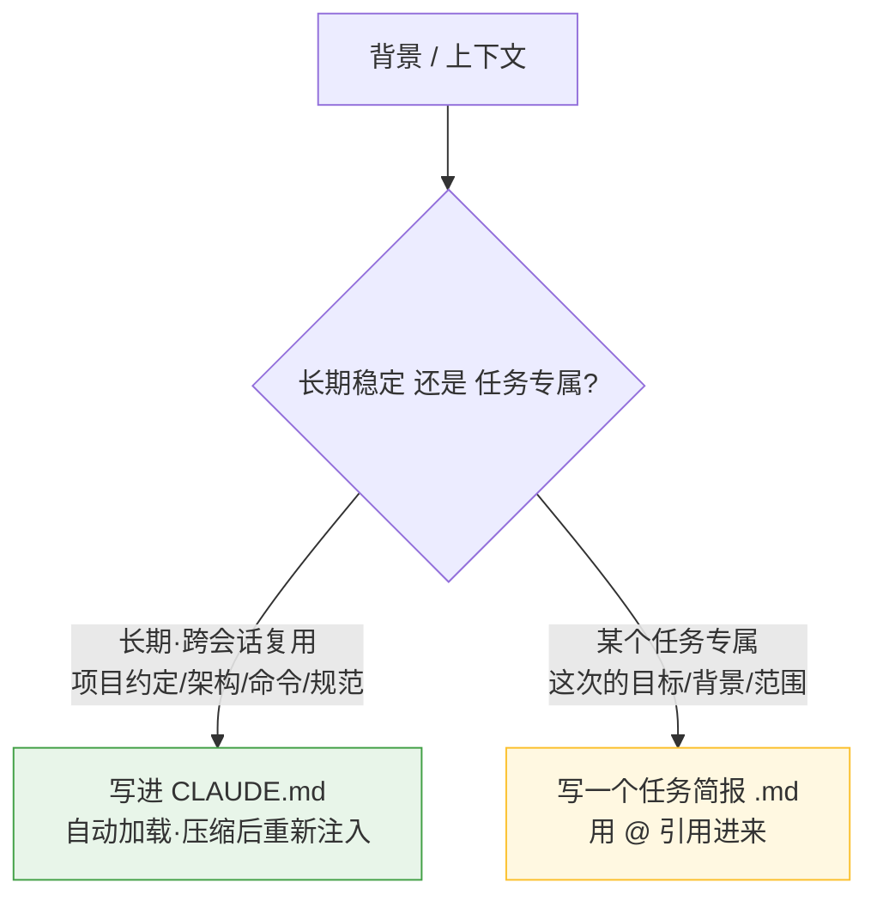

# 怎么给 AI 好的上下文?

> 问题:给 AI(Claude)哪些上下文更好?代码历史/更新要不要给?背景描述放在一个 markdown 里是不是更好?
>
> 核心心智模型:**把 AI 当成一个"很聪明、但刚入职、没有项目记忆"的工程师。**
> 你会给新同事什么背景,就给它什么 —— 但要更**精炼**,因为它的上下文是有预算的:
> **相关 > 越多越好。**

---

## 一、高价值上下文(按价值从高到低)

| 给什么 | 为什么关键 |
|--------|-----------|
| **目标 + 验收标准** | "什么算做完"(跑通哪个测试、接口返回啥)—— 最重要也最常被漏 |
| **背景 / 为什么** | 业务约束、起因、踩过什么坑 |
| **相关代码位置** | 用 `@文件` 指到具体文件/函数,让它**读**,别贴整库 |
| **规范 / 约定** | 用什么库、命名、风格、别用什么 |
| **示例** | "照着 X 的写法来" —— 给一个相似实现,效果远超纯文字 |
| **现状 / 错误** | 真实报错、失败测试输出、复现步骤(别只说"报错了") |
| **边界(别碰什么)** | 明确 out-of-scope、哪些文件不要动 |
| **相关历史变更** | 挑相关的给(见第三节) |

---

## 二、放哪种形式(背景用 markdown,是更好)

分两层放:



为什么 markdown 比"散在对话里"好:
- **结构化** —— 逼你把事情说清楚;
- **可复用** —— `@` 一引用就进上下文;
- **抗压缩** —— 文件不会因为 compact 丢失(对话会),需要时再 `@` 一次即可。

---

## 三、代码历史:要给,但"精准投喂"

有用,但**别给全量 git log**(全是噪音、烧上下文)。给这几种:

- 跟任务相关的**最近 diff**:`!git diff main...HEAD`、`!git log --oneline -10`;
- "我们正在做 X 迁移,**别动 Y**";
- **失败过的尝试**:"之前试过 A 方案不行,因为…" —— 避免它重复提。

---

## 四、反模式(别这么给)

- ❌ 把整个仓库 / 一堆无关文件全塞进去 → 稀释注意力、烧上下文。
- ❌ 过时的信息 → 直接误导它。
- ❌ 几百行原始日志 → 截取关键片段就好。
- ❌ 把关键背景埋在很长的对话里 → 压缩后就丢,不如落到文件。

---

## 五、任务简报模板(可直接套)

```markdown
## 目标
（这次要做成什么,一句话）
## 背景 / 为什么
（业务约束、起因、相关历史）
## 相关代码
@path/to/file.go  @path/to/other.go
## 验收标准
- [ ] 跑通 xxx 测试
- [ ] 接口返回 yyy
## 不要做 / 边界
（哪些别碰、out of scope）
## 已知坑 / 失败过的尝试
（避免重复踩）
```

---

## 一句话总结

> **稳定的背景写进 CLAUDE.md,任务背景写成简报 markdown 用 `@` 引用,
> 代码用 `@` 让它读,历史只给相关的 diff** —— 精准、结构化、可复用,胜过把一切堆进对话。
>
> 配套:[Claude Code 实用技巧](Claude-Code实用技巧.md) 的上下文管理一节。
