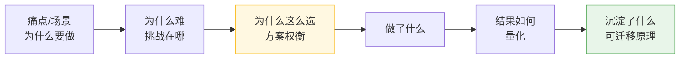
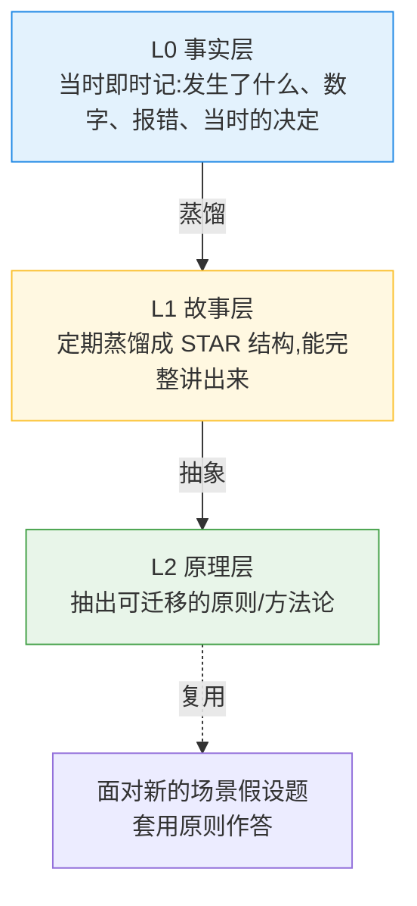

# 技术笔记怎么写,才能在面试里讲得清楚、有逻辑

> 一个想法:工作中宝贵的经验,如何记录,才能在面试里**有逻辑地叙述**出来,
> 而不是干巴巴地"我做了 X"。现在面试普遍考**场景题**,逻辑越清晰越有力。
>
> 核心主张:**记笔记时把"为什么"和"权衡"当主角,"做了什么"只是配角。**
> 因为面试官想听的是你的**判断逻辑**(一条因果链),而不是动作清单;
> 而数字、当时的纠结、可迁移的原理,事后都补不回来,必须当时记。

---

## 一、为什么"讲不清楚"——笔记只剩 Action 层

大多数笔记只记了"做了什么"(Action),丢掉了:

- **场景与约束**:当时什么处境、什么限制。
- **为什么难 / 为什么这么选**:有哪些选项、权衡了什么、放弃了什么。
- **量化结果**:具体数字。
- **可迁移的原理**:能套到别的场景的那条原则。

而"逻辑有力"的本质,是一条**处处回答"为什么"的因果链**:



面试官会层层追问"为什么";如果笔记里早有这条链,临场就不慌。

---

## 二、记录法:三层高度

一条经验拆成三个高度,各有用途——别只停在 L0。



- **L0 事实层(当时记,允许乱)**:报错、关键数字、做了哪个决定、为什么当时这么定。
  这些**事后补不回来**,所以重点是"即时、原始"。
- **L1 故事层(定期蒸馏)**:把 L0 整理成下面的 STAR 升级结构,做到能在面试里完整复述。
- **L2 原理层(抽象)**:从故事里抽一条**可迁移原理**,专门用来答"如果遇到 XX 场景你会怎么做"。

---

## 三、L1 模板:STAR 升级版(关键在"权衡")

| 段 | 记什么 | 为什么重要 |
|----|--------|-----------|
| **S 场景** | 背景、约束、痛点 | 让人秒懂"为什么值得做" |
| **T 目标/挑战** | 要解决什么、难点、什么算成功(指标) | 立起评判标准 |
| **A·权衡** ⭐ | 有哪些方案、为什么选它、放弃了什么 | **逻辑与深度全在这,区分初级/资深** |
| **A·行动** | 具体做了什么(简洁) | 别只停在这层 |
| **R 结果** | 量化(从 X 降到 Y、省了 N 个任务) | 数字最有说服力 |
| **R+ 复盘** | 抽一条可迁移原理 | 答场景假设题靠它 |

### 可直接套用的填空模板

```
【场景 S】______(业务背景 + 约束 + 痛点,1~2 句)
【目标 T】要解决______;难点在______;成功标准 = ______(指标)
【权衡 A】候选方案:① ___ ② ___ ③ ___
         选了 ②,因为______;放弃 ①/③,因为______
【行动 A】______(简洁列动作)
【结果 R】______(量化:X → Y,提升 __%)
【沉淀 R+】可迁移原理:______(一句能套到别处的原则)
```

---

## 四、一个范例(用"报表查询优化"经历)

> 对应仓库里 `docs/想法/实时报表查询设计.md`,把它"翻译"成面试能讲的故事。

- **场景 S**:报表查询慢,老板直接反馈;原方案是定时任务跑批预聚合,实时性差、任务多、维护重。
- **目标 T**:在**不压主库**的前提下,既要**实时**,又要扛**历史大数据量聚合**;
  成功标准 = 查询从 ~X 秒降到 ~Y 秒,并砍掉 N 个跑批任务。
- **权衡 A** ⭐:
  - 方案①继续优化跑批 —— 治标,实时性根本问题不解决,放弃;
  - 方案②全量实时查 MySQL 从库 —— 大聚合扛不住,放弃;
  - 方案③冷热分离(**最终方案**):历史跑批固化 + 热数据查实时表 + 查询层合并;
    实时表再**按查询特征**在"从库(小而精强一致)/ CK(大而广重聚合)"间路由。
  - 选③的理由:把"写时计算"改"读时计算"只在热区做,压力可控;历史只算一次。
- **行动 A**:实现冷热时间边界切分、查询路由、结果合并;搭/复用同步链路。
- **结果 R**:查询耗时 X→Y,跑批任务从 N 个降到 M 个,实时性从"小时级"到"秒级"。
- **沉淀 R+**(可迁移原理):
  1. **写时计算 vs 读时计算**的取舍;
  2. **冷热分离 / Lambda 思想**——固化的历史只算一次,只对热数据实时算;
  3. **按查询特征选存储引擎**(OLTP 点查 vs OLAP 聚合)。

> 答场景题时,直接抛 R+ 里的原理,再用这个故事佐证 —— 这就是"有逻辑"。

---

## 五、几个实操提醒

1. **当时就记数字**:性能、耗时、数据量、影响范围;事后只剩"挺快的""提升不少",毫无说服力。
2. **"为什么"比"做了什么"值钱**:每个决定都补一句"为什么这么选 / 放弃了什么"。
3. **每条经验抽一条可迁移原理**:场景题考的是原理的迁移能力,不是你那个具体项目。
4. **复盘类也适用**:仓库里 `docs/反思/` 的"事件经过→问题分析→根因→改进",
   其实就是 STAR 的变体,同样能"翻译"成面试中的行为/场景回答。
5. **定期蒸馏**:L0 随手记,隔段时间集中把值得讲的整理成 L1/L2,别让原始记录烂在角落。

---

## 六、一句话总结

> **好的技术笔记 = 一条"为什么"的因果链 + 量化结果 + 可迁移原理。**
> 记的时候为面试中的"被追问"和"场景迁移"准备好答案,临场只是复述,而不是临时编逻辑。

> 后续可展开:给仓库做一个统一的 L0→L1→L2 模板文件;
> 把已有的想法/反思都补上 R+ 可迁移原理一栏。
