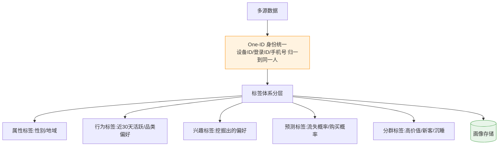
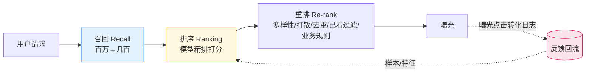
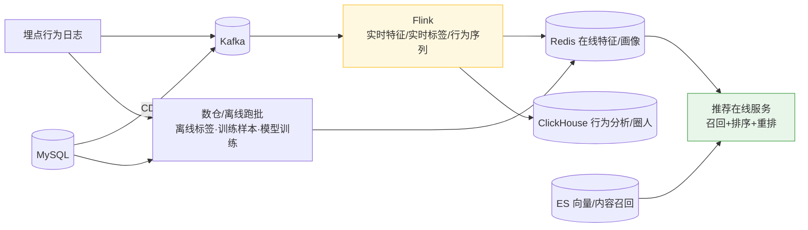

# 推荐系统 & 用户画像:需要哪些数据,怎么设计

> 问题:推荐系统和用户画像需要哪些数据支撑?该如何设计?
>
> 先理清关系:**用户画像是推荐系统的"燃料"之一** —— 数据 → 画像/特征 → 推荐。
> 两者共享同一套数据底座。下面分:数据底座 → 画像设计 → 推荐分层 → 落到现有栈(CK/MySQL/ES/Flink/Redis)。

---

## 一、需要哪些数据(共用底座)

| 数据类型 | 内容 | 作用 |
|---------|------|------|
| **行为数据(最核心)** | 浏览/点击/搜索/停留/收藏/加购/播放/点赞 | 兴趣信号、训练样本 |
| **属性数据** | 性别/年龄/地域/设备/注册渠道 | 静态画像、冷启动 |
| **交易数据** | 购买历史、客单价、品类、频次(RFM) | 价值/偏好标签 |
| **物品数据(item 画像)** | 类目/标签/价格段/内容向量/热度 CTR | 物品侧特征、内容召回 |
| **上下文** | 时间/场景/位置/设备 | 场景化推荐 |
| **反馈** | 显式(评分)+ 隐式(点击/跳出) | label、闭环迭代 |

> 地基是 **埋点规范 + 数据质量**:埋点乱了,画像和推荐全是错的。

---

## 二、用户画像怎么设计

设计要点:
1. **One-ID 是地基**:先把跨端跨设备的同一个人归一,否则画像是碎的。
2. **标签分层**:事实/统计标签(跑批算)、规则标签、模型挖掘标签(兴趣/预测)。
3. **实时 + 离线结合**(Lambda):稳定标签离线跑批,近期行为标签实时算。
4. **存储分两用**:在线点查存 **KV(Redis/HBase)**;分析/圈人存 **数仓/CK**(标签宽表)。

---

## 三、推荐系统怎么设计(经典分层)

- **召回(多路)**:协同过滤、内容相似、热门兜底、**向量召回(ANN)**、规则。
- **排序**:特征(用户画像 + item 特征 + 上下文)喂模型(LR/GBDT → 深度模型 DIN 等)打分。
- **重排**:多样性、打散、去重、过滤已看、业务策略。
- **闭环**:曝光-点击-转化日志回流 → 更新特征/样本 → 重训模型 → 上线。
  **这个闭环是推荐能越用越准的关键。**

---

## 四、落到现有栈(Kafka / Flink / CK / ES / Redis / 数仓)

- **实时链路**:行为日志 + CDC → Kafka → Flink 算实时特征/行为序列 → 写 Redis(在线读)。
- **离线链路**:数仓跑批算稳定标签、生成训练样本、训模型。
- **召回**:**ES 已有,正好做向量/内容召回**(量再大可上 Milvus)。
- **分析/圈人**:CK 扛多维分析和人群圈选。
- **在线服务**:从 Redis 读特征 → 多路召回 → 模型排序 → 重排返回。

> 这条实时+离线双链路,和 [实时查询架构-CK-MySQL-ES与Flink](实时查询架构-CK-MySQL-ES与Flink怎么配合.md) 是同一套底座。

---

## 五、几个绕不开的设计点

- **冷启动**:新用户/新 item 用属性 + 热门 + 内容兜底。
- **实时性**:用户刚点的要快速反映(实时行为序列特征)。
- **数据闭环**:没有反馈回流,推荐就停在第一版。
- **评估**:离线(AUC)+ 在线(CTR/CVR + A/B test),以在线为准。
- **隐私合规**:画像涉及个人数据,注意脱敏与合规边界。

---

## 一句话总结

> **先把数据底座和 One-ID 打好 → 用画像/特征喂推荐的"召回→排序→重排"三段 →
> 用曝光反馈回流形成闭环。**
> 现有的 Kafka/Flink/CK/ES/Redis 正好能拼出实时 + 离线两条链路。
