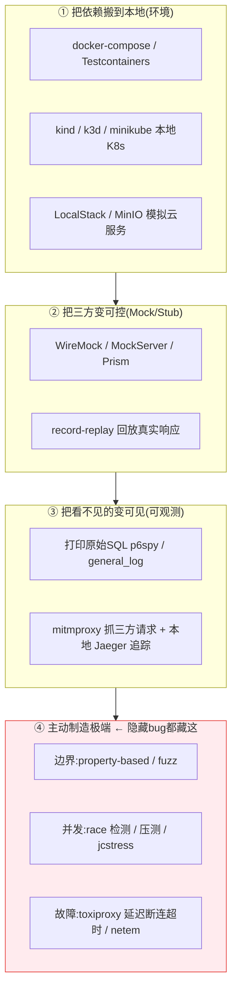

# 本地自测工具箱:如何模拟环境、逼出隐藏 bug

> 一个想法:怎么优化自己的本地自测流程。已有的招:docker 自测、docker 里跑 K8s 自测、
> docker 里打印原始 SQL、模拟三方服务启动。还能加哪些辅助本地模拟的工具?
> 目标:逼出**隐藏 bug、各种边界场景、各种并发场景**——越多工具越好。
>
> 核心框架:本地自测分四层 —— **① 把依赖搬到本地、② 把三方变可控、
> ③ 把看不见的变可见、④ 主动制造极端**。隐藏 bug 大多藏在被忽略的第 ④ 层。

---

## 一、四层框架

已有的 docker / k8s / SQL / 三方模拟,覆盖了 ①②③;
**真正逼出"隐藏、边界、并发"bug 的是第 ④ 层,重点补它。**

---

## 二、分层工具箱

### ① 环境:把依赖搬到本地
| 工具 | 用途 |
|------|------|
| docker-compose | 一键拉起 DB / Redis / Kafka 等依赖 |
| **Testcontainers**(Java/Go/Py/Node/.NET) | 在测试代码里**按需起完即销毁**的容器,集成测试神器 |
| kind / k3d / minikube / k3s | 本地跑 K8s 自测 |
| Tilt / Skaffold | K8s 本地开发热回环 |
| **LocalStack** | 本地模拟 AWS(S3/SQS/DynamoDB…) |
| MinIO | S3 兼容对象存储 |
| GCP pubsub / firestore emulator | 本地模拟 GCP 服务 |

### ② 三方:把外部依赖变可控
| 工具 | 用途 |
|------|------|
| **WireMock / MockServer** | HTTP 接口打桩,可设延迟、错误码、按请求匹配 |
| **Prism** | 直接用 OpenAPI 规范起 mock,契约即 mock |
| Hoverfly / smocker / Mockoon | 录制-回放 / 多场景 / GUI 配置 |
| Mountebank | 多协议(含 TCP)打桩 |
| grpcmock / 自建 stub | gRPC 三方模拟 |
| **Pact / Spring Cloud Contract** | 契约测试,保证你和三方的接口约定不漂移 |

### ③ 可见:把看不见的变可见
| 工具 | 用途 |
|------|------|
| **p6spy / datasource-proxy** | 打印带**真实参数**的原始 SQL(JDBC) |
| Hibernate show_sql / MyBatis log / GORM Logger / SQLAlchemy echo | ORM 层打印 SQL |
| MySQL `general_log` / `slow_query_log` | 看实际下发与慢查询 |
| **mitmproxy** | 抓 / 改 HTTP(S) 请求,看清和三方到底收发了什么 |
| 本地 Jaeger / Tempo(all-in-one docker) | 本地分布式追踪 |
| 本地 Prometheus + Grafana / Loki | 本地看指标与日志 |
| tcpdump / Wireshark | 抓包,排查协议层问题 |

### ④ 极端:主动制造隐藏/边界/并发/故障(重点)

**边界 / 隐藏 bug**
| 工具 | 用途 |
|------|------|
| **Property-based**(Hypothesis / jqwik / fast-check / gopter / proptest) | 你写"规则",它自动生成海量极端输入撞边界 |
| **Fuzzing**(`go test -fuzz` / Jazzer / atheris / AFL++ / cargo-fuzz) | 喂随机/畸形输入,挖崩溃与未处理分支 |
| **Mutation testing**(PIT / mutmut / Stryker) | 故意改坏代码,验证你的测试是不是"假覆盖" |
| Snapshot / approval testing | 锁住复杂输出,回归时一眼看出差异 |

**并发**
| 工具 | 用途 |
|------|------|
| **Race detector**(`go test -race` / TSan) | 几乎必开,直接抓数据竞争 |
| jcstress | Java 并发压力测试 |
| k6 / vegeta / wrk / hey / bombardier / Locust / Gatling | 制造高并发,逼出竞态、死锁、连接池耗尽 |
| 人为加随机 sleep / 循环跑 N 次 | 放大时序窗口,复现偶现并发 bug |

**故障注入 / 混沌**
| 工具 | 用途 |
|------|------|
| **toxiproxy** | 给依赖注入**延迟/超时/断连/半关闭/限带宽**,专测超时·重试·熔断 |
| tc / netem(Linux) | 模拟网络延迟、丢包、乱序 |
| Pumba | docker 容器混沌(kill / netem) |
| docker `--memory --cpus --pids-limit` + stress-ng | 模拟资源受限 / OOM / CPU 饱和 |
| **libfaketime** | 伪造时钟,测时区·夏令时·跨天·过期·闰秒 |
| chaos-mesh | K8s 环境混沌 |

**逼真度(用真实流量撞边界)**
| 工具 | 用途 |
|------|------|
| **GoReplay** | 录制生产流量,本地回放 —— 撞出你编不出来的真实边界 |
| mirrord / Telepresence | 让本地代码"长在"集群里,用真实上下游联调 |
| Faker(faker / datafaker / gofakeit) | 批量生成贴近真实的测试数据 |

---

## 三、按 bug 类型反查该上什么工具

| 想抓的 bug | 首选工具 |
|-----------|----------|
| 隐藏 / 未知输入边界 | property-based、fuzzing、生产流量回放 |
| 边界值(空/超长/0/负/溢出/emoji) | property-based + 边界数据清单(见下) |
| 并发 / 竞态 / 死锁 | race detector、压测、jcstress、随机 sleep |
| 三方超时 / 抖动 / 断连 | toxiproxy、netem |
| 时间相关(时区/夏令时/过期) | libfaketime |
| 资源耗尽(OOM/连接池/磁盘满) | docker 资源限制、stress-ng |
| SQL 错误 / N+1 / 慢查询 | p6spy、general_log、slow_query_log |
| 三方收发不符预期 | mitmproxy、契约测试 |
| 测试本身可信吗 | mutation testing |

---

## 四、边界数据清单(手动构造也要覆盖)

- **空与缺失**:null、空串、空集合、缺字段
- **极值**:0、负数、最大/最小整数(溢出)、超长字符串、超大集合
- **字符**:Unicode、emoji、前后空格、换行、SQL/HTML 特殊字符(注入)
- **数值精度**:浮点误差、金额用整数分、除零
- **时间**:时区、夏令时切换、月末/年末、闰年闰秒、过期/未来时间
- **顺序与重复**:乱序、重复、幂等(消息重复消费)
- **并发**:同一资源同时读写、首次初始化竞争

---

## 五、落地建议(别一次堆满)

1. **必开的低成本项先上**:`-race`、property-based 写几个核心函数、p6spy 打 SQL。
2. **集成测试统一用 Testcontainers**:告别"我本地能跑",依赖随测试起销。
3. **凡是调三方,默认配 toxiproxy**:超时/重试/熔断是最常见的线上事故源,本地就压。
4. **定期来一轮 mutation testing**:体检测试质量,别让覆盖率骗了自己。
5. **沉淀一份"边界数据清单"**:每写一个接口,对着清单过一遍。

> 一句话:**把环境搬到本地只是起点;真正值钱的是主动制造延迟、并发、畸形输入和故障——
> 隐藏 bug 不会自己冒出来,要你逼出来。**

> 后续可展开:把这些做成项目的 `make test-*` 一键命令;给 CI 也接上 race / fuzz 短跑。
