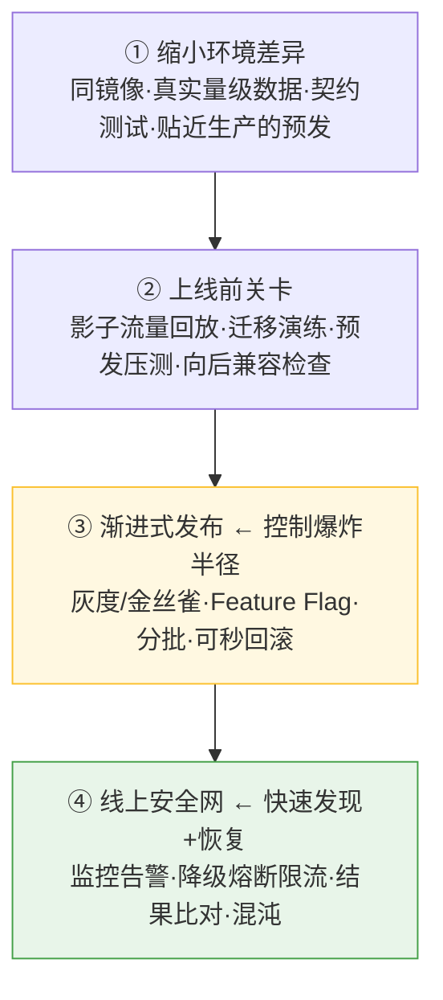

# 防止线上出问题:测试环境测不出的问题怎么防

> 问题:还有哪些好办法,能防止发到线上才出问题 —— 尤其是那些**在测试环境不容易出现**的问题?
>
> 核心认知:**这类问题靠"把测试做得更狠"消除不掉。**
> 测试环境天生是「受控、静态、小规模、短时」的,生产是「混乱、动态、大规模、长期运行」的。
> 这道鸿沟堵不死。正确策略是**纵深防御**:能缩小差异的缩小,残余风险靠
> **"控制爆炸半径 + 快速发现恢复"** 来兜。

---

## 一、先认清:哪些问题专挑线上爆

| 类别 | 测试环境为什么测不出 |
|------|--------------------|
| **数据**:量级 / 倾斜 / 脏数据 / 历史遗留 | 测试数据又小又干净(见 [大数据场景](大数据场景的降风险与本地模拟测试.md)) |
| **流量/并发**:峰值、热点、缓存击穿、惊群 | 测试没有真实并发 |
| **三方**:超时、限流、抖动、返回格式差异 | 测试用的是 mock |
| **环境/配置**:版本、连接池、时区、JVM 参数不一致 | 两套环境配置有 drift |
| **分布式**:多实例竞态、分布式锁、网络分区 | 测试常是单机 |
| **时间累积**:内存/连接泄漏、磁盘增长 | 测试跑几分钟就停 |
| **发布过程**:新旧版本共存、迁移与代码不兼容 | 测试是"干净部署一次" |

---

## 二、四层防御

### ① 缩小环境差异(让测试更像线上)
- **同一镜像贯穿测试到生产**(build once, deploy many),配置外置并 diff,杜绝环境 drift。
- **用真实量级 + 真实分布的数据**(见大数据篇)。
- **预发 / staging 尽量贴近生产**:同规格、同拓扑、连真实依赖的影子。
- **契约测试(Pact)**:保证三方接口不漂移,别让 mock 骗了你。

### ② 上线前关卡(发布前就撞出来)
- **影子流量 / 流量回放(GoReplay)**:把生产真实流量复制一份打到新版本(不影响用户),
  用真实流量 + 真实量级提前撞问题 —— 专治"测试编不出来的场景"。
- **DB 迁移演练**:在**生产数据副本**上跑一遍迁移,别在生产首跑;并确认新代码兼容旧数据。
- **预发压测**:用真实量级压,看性能与资源水位。
- **向后兼容检查**:滚动发布期间新旧版本共存,接口/数据必须向后兼容。

### ③ 渐进式发布(控制爆炸半径)← 最重要
- **灰度 / 金丝雀**:先放 1% 流量,看指标再逐步扩。
- **Feature Flag**:新功能用开关包起来,出问题**秒关开关**,无需回滚部署。
- **分批发布**:按 region / 实例分批。
- **可秒级回滚**:把"全量翻车"降级成"1% 受影响 + 快速撤回"。

### ④ 线上安全网(快速发现 + 恢复)
- **可观测三板斧**:错误率、延迟、饱和度(连接数/CPU/内存)全上监控告警。
  很多线上问题不是"防住",而是**第一时间发现并回滚**。
- **兜底机制**:超时 + 重试 + 熔断 + 限流 + 降级 —— 三方抖动/被打爆时不被拖死
  (上线前用 toxiproxy 验证这些逻辑对不对,见 [工具箱](本地自测工具箱-逼出隐藏bug.md))。
- **双写 / 结果比对**(GitHub Scientist 式):改造关键逻辑时,新旧逻辑同时跑、只用旧结果、
  后台 diff 差异 —— 提前发现"线上才暴露"的不一致。
- **混沌工程 + 长稳测试**:预发/小范围主动注入故障验证韧性;长时间 soak test 逼出内存/连接泄漏。

---

## 三、一张"按问题选武器"对照

| 测不出的问题 | 主要靠 |
|-------------|--------|
| 大数据/慢查询 | 真实量级数据 + EXPLAIN + 预发压测 |
| 真实并发/峰值 | 影子流量 + 压测 + 灰度观察 |
| 三方抖动/超时 | 熔断/降级/超时 + toxiproxy 预演 + 契约测试 |
| 配置/环境 drift | 同镜像 + 配置外置 diff |
| 分布式竞态 | 多实例预发 + 混沌(网络分区) |
| 内存/连接泄漏 | 长稳 soak test + 饱和度监控 |
| 迁移/兼容 | 生产副本迁移演练 + 向后兼容 + 灰度 |
| 未知未知 | 灰度 + 监控告警 + 可秒回滚(兜底一切) |

---

## 四、一句话总结

> **别指望"测得更全"来杜绝线上问题 —— 测试环境的鸿沟堵不死。**
> 成熟做法是纵深防御:同镜像 + 真实数据**缩小差异**,影子流量/迁移演练**提前撞**,
> 灰度 + Feature Flag **控制爆炸半径**,监控 + 降级 + 可回滚**快速兜底**。
>
> 这跟"承认本地边界、把风险管理起来"是同一个思路 —— **承认测不全,然后让"测不出的那部分"也炸不大、好恢复。**

> 后续可展开:整理一份"发布前 checklist"(灰度比例、回滚预案、监控项、迁移演练);
> 给关键功能默认接 Feature Flag。
